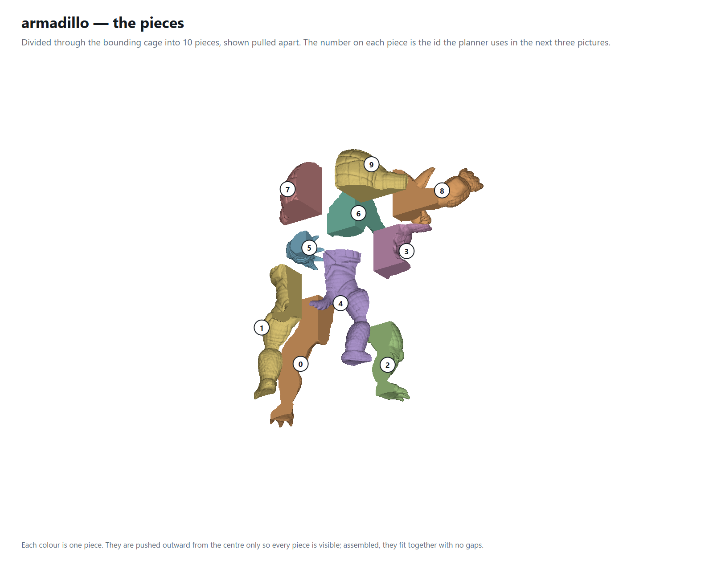
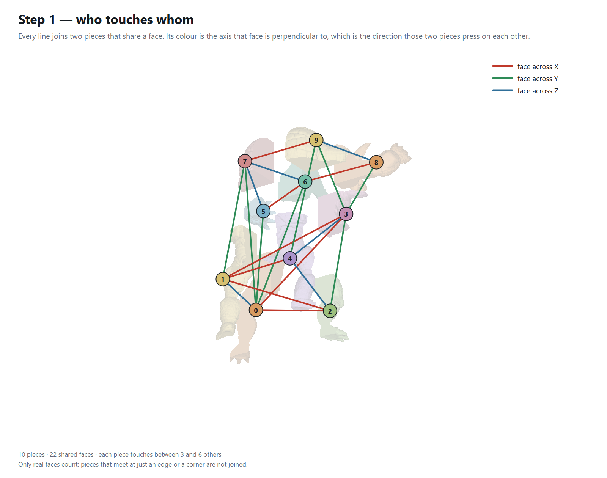
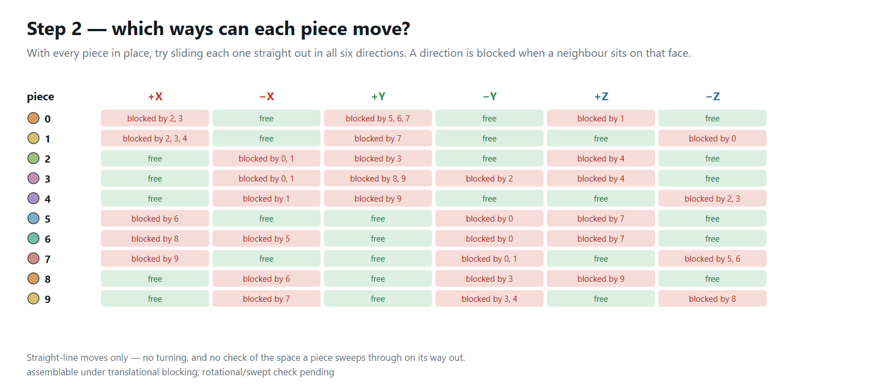
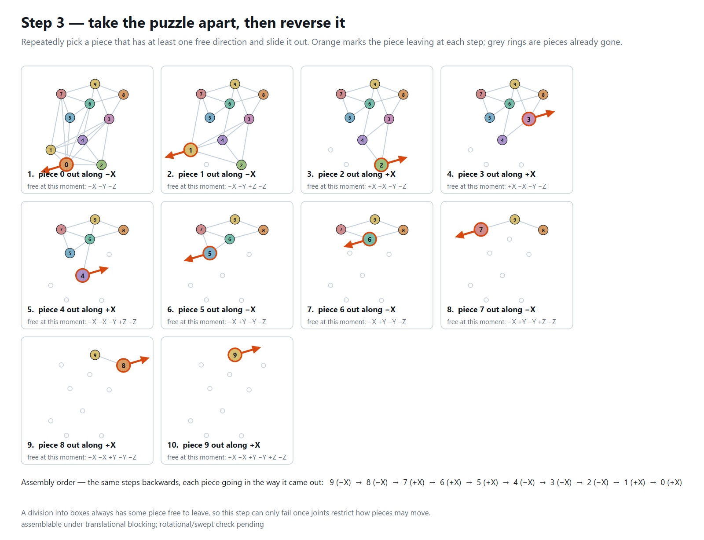

# The Puzzle Divider — complete architecture

*A reference for the whole codebase: what every file does, what every library is
for, and how one model becomes a set of assemblable puzzle pieces.*

This document is the authoritative map. It was written by reading the code, not
from memory, and every line reference in it was checked against the file it
names. Where the code has a stub, a placeholder or a known defect, this says so
in the same voice it describes the working parts — a document you cannot trust
on the weak points is no use on the strong ones.

---

## Contents

**Part I — the ground**
1. [What the program is](#1-what-the-program-is)
2. [The stack: every library and why it is there](#2-the-stack-every-library-and-why-it-is-there)
3. [Build configuration, and the four things that will bite](#3-build-configuration-and-the-four-things-that-will-bite)
4. [The layer map](#4-the-layer-map)
5. [The three types everything is built on](#5-the-three-types-everything-is-built-on)

**Part II — the pipelines**
6. [Two pipelines, one app](#6-two-pipelines-one-app)
7. [The V-rep pipeline, traced end to end](#7-the-v-rep-pipeline-traced-end-to-end)
8. [The mesh pipeline, traced end to end](#8-the-mesh-pipeline-traced-end-to-end)

**Part III — the modules**
9. [Loading and the IRIT boundary](#9-loading-and-the-irit-boundary)
10. [Representation: the cage](#10-representation-the-cage)
11. [Measurement: the voxel field](#11-measurement-the-voxel-field)
12. [Division: the BSP and its cost function](#12-division-the-bsp-and-its-cost-function)
13. [Trimming: Elber's Section 5 Boolean](#13-trimming-elbers-section-5-boolean)
14. [The assembly planner](#14-the-assembly-planner)
15. [Joints](#15-joints)
16. [Export](#16-export)
17. [Rendering and the UI](#17-rendering-and-the-ui)

**Part IV — using and extending it**
18. [Command-line reference](#18-command-line-reference)
19. [Where each research claim lives in the code](#19-where-each-research-claim-lives-in-the-code)
20. [Real, stubbed, placeholder — the honest inventory](#20-real-stubbed-placeholder--the-honest-inventory)
21. [Known limitations](#21-known-limitations)
22. [Extension points](#22-extension-points)
23. [File index](#23-file-index)
24. [Glossary](#24-glossary)

---

# Part I — the ground

## 1. What the program is

A Qt desktop application that takes a 3D solid, divides it into printable puzzle
pieces, decides which joint goes on which face, and checks whether the result
can actually be put together. It extends Gershon Elber, *On the Construction of
Freeform Volumetric 3D Puzzles* (2025).

**The research contribution is the assembly planner.** Elber lists automatic
(dis)assemblability verification as open future work. The divider and the joints
are supporting machinery that had to exist before the planner had anything to
plan.

The ranking that decides where effort goes:

| Rank | Part | Whose |
|---|---|---|
| 1 | assembly planner + collision verification | **ours — this is the research** |
| 2 | self-locking joints | ours, building on his pin |
| 3 | dividing the solid | mostly Elber's; working, not to be polished further |

Three things distinguish the division from Elber's as published, and they are
the parts worth defending in a talk:

- **The cuts are chosen by a cost function**, minimised per cell against the
  material actually present, rather than by a threshold ratio.
- **The piece count is exact**, because the split is material-aware: no cell can
  come out empty, so none is dropped afterwards.
- **Every piece is a single connected lump**, enforced during the split rather
  than repaired after it.

---

## 2. The stack: every library and why it is there

### 2.1 Qt 6.6.2 (MSVC 2019, 64-bit)

Four modules, declared in the `.vcxproj` as `QtModules: core;gui;quick;concurrent`.

| Module | Used for |
|---|---|
| **Core** | `QVector`, `QString`, `QHash`, `QRandomGenerator`, `QElapsedTimer`, the property/signal system. `QVector` is the container for every geometry array in the app. |
| **Gui** | `QImage`, `QPainter`, `QGuiApplication`. The renderer rasterises into a `QImage` by hand. |
| **Quick** | The UI. `QQmlApplicationEngine`, `QQuickPaintedItem` (which `MeshView` derives from), `main.qml`. |
| **Concurrent** | Linked, but nothing in the current code calls it. Loading and dividing both run on the GUI thread. |

There is **no Qt Quick 3D**. It is not installed on this machine, which is why
`MeshView` is a hand-written software z-buffer rasteriser rather than a scene
graph (§17).

### 2.2 IRIT — the geometry kernel

IRIT is Gershon Elber's own solid-modelling kernel, and it is the reason this
project can do freeform volumetric work at all. It is a **C** library; the app
links 16 of its static libraries.

Include roots (from the `.vcxproj`):

```
C:\irit\irit\inc_irit ; C:\irit\irit\triv_lib ; C:\irit\irit
C:\irit\irit\symb_lib ; C:\irit\irit\cagd_lib ; C:\irit\irit\prsr_lib
```

Libraries, and what each is actually used for here:

| Library | Role in this project |
|---|---|
| **IritPrsr** | File I/O and the object model. Every loader and writer: `IritPrsrGetObjects2`, `IritPrsrSTLLoadFile`, `IritPrsrOBJLoadFile`, `IritPrsrIgesLoadFile`, `IritPrsrOBJSaveFile`, `IritPrsrPutObjectToFile3`. Also `IritPrsrObjectStruct`, the type every IRIT call passes around, and the tessellator entry `IritPrsrConvertFreeFormHierachy`. |
| **IritTriv** | **The trivariate library — the V-rep.** `IritTrivNSPrimBox` (the cage), `IritTrivTVRegionFromTV` (piece extraction), `IritTrivTVDomain`, `IritTrivTVEvalToData`, `IritTrivPrimSphere/Torus/Cylinder/Cone`. |
| **iritBool** | `IritBooleanAND` (Elber §5 trimming), `IritBooleanOR` and `IritBooleanSUB` (the joint pin and hole). |
| **iritCagd** | Curves and surfaces beneath the trivariates: `IritCagdBspCrvCreateCircle`, `IritCagdSrfFromCrvs` (the joint loft), `IritCagdCoerceToE3`, `IritCagdSrfBBox`. |
| **IritMisc** | Matrices and utility: `IritMiscMatGenMatTrans`, `…RotX1/Y1/Z1`, `…UnifScale`, `IritMiscMatMultTwo4by4`, `IritMiscStrdup`. |
| **iritGeom** | `IritGeomTransformObject`, and the triangulator that is deliberately *not* used (§9). |
| **IritSymb, iritTrim, IritTrng, IritMdl, iritMvar, IritVMdl, iritExt, IritUser, iritGrap, iritXtra** | Linked because IRIT's libraries reference each other and a static link needs them resolved. Of these only `IritUser` is called directly, and only from `IsoGcodeGenerator.cpp`, which is **not in the build** (§2.3). The rest are transitive. |

Plus `Ws2_32.lib` — Winsock, which IRIT's parser library requires for its
client/server display protocol even when no display is used.

> **Naming.** This build of IRIT uses `Irit`-prefixed symbols —
> `IritTrivTVDomain`, `IritTrivTVRegionFromTV`, `IritPrsrGetObjects2`,
> `CAGD_IS_RATIONAL_PT`. Some differ from the names in classic IRIT
> documentation and from Elber's own `.irt` scripts. **Always verify a symbol
> against the headers in `inc_irit` before using it**; guessing from the
> published API wastes a build cycle every time.

### 2.3 In the tree, but not in the build

Worth knowing so you do not go looking for their effect:

| Path | Status |
|---|---|
| `IsoGcodeGenerator.cpp` (2,013 lines) | The iso-parametric G-code slicer from the project's earlier life. **Not compiled** — it appears in no `ClCompile` entry. The README still describes it as a headline feature; the build disagrees. |
| `clipper/Clipper2-main/` | Vendored Clipper2 polygon-clipping library. **Not compiled.** No file in the build includes it. |
| `demo test files/` | Old `GCodeGenerator*.cpp` variants. Not compiled. |
| `main1.cpp` | An earlier entry point. Not compiled. |
| `JointGeometry.h` | Listed in the `.vcxproj` as a header, but **the file does not exist**. Harmless — headers are not compiled — but it is why the project mentions a module the code no longer has. It was the cell-box joint placer, removed because it placed joints on the cell face rather than on the material (§21). |

So the answer to *"what libraries did I use"* is short and honest: **Qt 6 and
IRIT**. Everything else in the tree is inheritance from the previous project.

### 2.4 Tooling outside the app

Not linked, but part of how the work is produced:

- **Python 3 + `python-pptx`** — generates the slide decks in `docs/`.
- **Headless Chrome** — renders the hand-authored SVG figures to PNG
  (`docs/figures/render_simple.py`).
- The figure scripts **assert their own arithmetic**, so a figure that disagrees
  with the algorithm fails to build rather than shipping a wrong picture.

---

## 3. Build configuration, and the four things that will bite

Native Visual Studio `.vcxproj` — **not CMake**. One project, one solution
(`QtQuickApplication1.slnx`). Platform x64 only. `__WINNT__` is defined for
IRIT's benefit. Debug links the `D64` IRIT libraries, Release the plain `64` set.

**1. Release does not link.** The prebuilt IRIT release libraries were compiled
with `/GL` (whole-program optimisation) under an older MSVC, so link-time code
generation fails with `C1900` / `LNK1257`. Debug is unaffected and is the only
configuration that builds. Fixing it means rebuilding IRIT's release libraries
with the current toolset, or without `/GL`.

**2. A `Q_OBJECT` header must be set to Item Type = moc in Visual Studio**, or it
compiles and then fails to link with missing vtable symbols. Two headers need
it: `AppController.h` and `MeshView.h`.

**3. `$(MSBuildProjectDirectory)` is on the include path** so files in
`AssemblyDivider/` can `#include "PuzzleDivider.h"` without a relative path.

**4. `IritTrivTVEvalToData` writes an IRIT control-point vector**, not an xyz
triple: index 0 is the weight and 1..3 are x, y, z. Divide through by the weight
when `CAGD_IS_RATIONAL_PT(PType)` is true. Getting this wrong produces geometry
that is subtly the wrong scale rather than obviously broken.

---

## 4. The layer map

Each arrow is a one-way dependency. Nothing below reaches back up.

```
   main.cpp ──► CLI modes (9 of them)
        │
        └────►  QML engine ──► main.qml ◄──► AppController
                                                  │
    ┌─────────────┬──────────────┬────────────────┼──────────────┐
    ▼             ▼              ▼                ▼              ▼
 CadLoader   MaterialField   PuzzleDivider   Planner::*      MeshView
 Trivariate    (voxels)      MeshDivider     Graph/Blocking  (renderer)
    │             │          AssemblyDivider Order/Joints
    │             │              │           AssemblyPlanner
    │             │              │           AssemblyOrder
    ▼             │              ▼                │
 IritMesh         │          CageBoolean          ▼
 IritGuard        │          IritSolid         IritJoint
    │             │              │                │
    ▼             ▼              ▼                ▼
 ┌──────────────────── MeshData ─────────────────────┐
 └───────────────────────────────────────────────────┘
                        │
                        ▼
              IRIT C libraries (16)
```

Four invariants hold throughout, and they are what keep the codebase navigable:

- **`MeshData` is the only currency.** Every module takes and returns it.
- **No IRIT type appears in any header** except `IritMesh.h` and `IritSolid.h`,
  both explicitly marked internal. Everything else compiles without the kernel's
  headers in scope.
- **The planner has no kernel dependency at all.** It works on the pieces'
  boxes. That is deliberate: the research module can be tested with no geometry
  kernel in the loop, so a planner bug can never be an IRIT bug.
- **Every IRIT call that can fail runs inside `IritGuard::run`.** There is no
  unguarded path into the kernel.

---

## 5. The three types everything is built on

### `MeshData` — `MeshData.h`

Flat arrays, deliberately dumb. No Qt Quick types, no IRIT types.

| Field | Meaning |
|---|---|
| `pos` | 3 floats per vertex |
| `tris` | 3 indices per triangle |
| `edges` | 2 indices per edge, deduped |
| `triNrm` | unit face normal per triangle |
| `polylineEdges` | curve segments, merged into `edges` by `buildEdges()` |
| `bmin` / `bmax` | bounding box |
| `sourceKind`, `objectCount`, `freeformCount`, `polygonCount` | provenance, for diagnostics |

`finalize()` runs `computeBounds`, `computeNormals`, `buildEdges` in that order.

> **Call `finalize()` before testing `isEmpty()`.** `buildEdges()` is what moves
> polyline segments into `edges`; a curve-only file looks empty until it runs.
> That ordering was a real bug once.

Vertices weld on **exact float equality**, with `-0.0` normalised to `0.0` so a
signed zero cannot split a seam. STL repeats every vertex per facet, so welding
is what turns a triangle soup into a mesh with a meaningful edge list. For
geometry that came out of the *tessellator*, exact equality is not enough — see
`IritSolid::weldClose` in §13.

### `PuzzlePiece` — `PuzzleDivider.h`

| Field | Meaning |
|---|---|
| `i, j, k` | Grid cell index. For a BSP leaf, `i` is the leaf index and `j`/`k` stay 0 rather than pretending to be coordinates |
| `p0`, `p1` | **The cell box** — parameter space on the V-rep path, world space on the mesh path |
| `mesh` | The piece's own geometry |
| `centre`, `size` | Physical bbox centre and extent, used by the exploded view |

> **`p0`/`p1` is the *cell*, not the piece's bounding box.** For a curved solid
> they differ a great deal: the cell is a box, the material inside it is not.
> Confusing the two is what broke joint placement, and it is the reason the
> planner counts phantom contacts (§14).

### `CellBox` — `PuzzleDivider.h`

One leaf of a recursive split: an axis-aligned box with `lo[3]`/`hi[3]`. Still a
box, so region extraction (V-rep) and box clipping (mesh) both work on it
unchanged. This is the single shared vocabulary between the two pipelines.

---

# Part II — the pipelines

## 6. Two pipelines, one app

The app can divide two different things, and which one runs depends on whether a
trivariate has been chosen. This is the single most important fork in the
codebase; almost every "why are there two of these?" question resolves here.

| | **V-rep pipeline** | **Mesh pipeline** |
|---|---|---|
| Subject | a `Trivariate` (the cage) | the loaded `MeshData` |
| Divider | `PuzzleDivider` | `MeshDivider` |
| Cut mechanism | region extraction in the **parameter domain** | **clipping** against world-space planes |
| A piece is | a sub-trivariate, tessellated | a clipped surface patch, capped |
| Trimming | `CageBoolean` intersects each piece with the model | none needed — it never left the model |
| Elber's method? | **yes, this is it** | no, it is the fallback for an STL with no V-rep |
| Entry point | `AppController::runTrivCellDivision` (`AppController.cpp:373`) | `AppController::runCellDivision` (`:403`) |
| Chosen when | `m_triv.isValid()` | otherwise |

`AppController::dividesMesh()` is what the UI reads to tell the user which one
is about to run.

**Both share the splitter.** `PuzzleDivider::buildBspCells` produces `CellBox`es
for either path; only what happens to a cell afterwards differs. That is why the
cost function, the material field and the connectivity guarantee benefit both.

---

## 7. The V-rep pipeline, traced end to end

This is Elber's construction, and it is the one to present. Six stages.

```
  model.stl
      │  CadLoader::load
      ▼
  MeshData  ──────────────────────────────────┐  (kept as m_sourceMesh)
      │  Trivariate::boundingCage             │
      ▼                                       │
  TrivTVStruct  (the cage, a trilinear box)   │
      │                                       │
      │  MaterialField::build(model, 96)      │
      ▼                                       │
  voxel grid + 3D prefix sum                  │
      │                                       │
      │  PuzzleDivider::buildBspCells         │
      ▼                                       │
  N CellBoxes in world proportions            │
      │  map world → parameter                │
      ▼                                       │
  N CellBoxes in (u,v,w)                      │
      │  PuzzleDivider::divideCells           │
      ▼   → IritTrivTVRegionFromTV ×3 per cell│
  N boxy sub-trivariates, tessellated         │
      │                                       │
      │  CageBoolean::intersectAll  ◄─────────┘
      ▼   → IritBooleanAND per piece
  N pieces with the MODEL's real surface
      │  AppController::applyJoints (optional)
      ▼
  pieces, displayed / exported
```

### Stage 1 — load

`CadLoader::load` routes everything through IRIT's parsers so that a native
`.itd` with freeform surfaces and a dumb triangle soup end up in exactly the
same `MeshData`. Details in §9.

The loaded mesh is kept in **two** places on purpose: `m_mesh` is what is
displayed, and `m_sourceMesh` is the untouched polygonal model. Adopting a
trivariate *replaces* `m_mesh` with the cage's tessellation, and Elber's Section
5 needs the original still around afterwards to intersect against.

### Stage 2 — the cage

`Trivariate::boundingCage` (`Trivariate.cpp:232`) builds a trilinear box over
the model's extent with `IritTrivNSPrimBox` (`Trivariate.cpp:160`). A
zero-thickness axis — a flat plate, a planar sketch — would make a degenerate
trivariate, so such an axis is padded by 0.5% of the diagonal.

This is a **placeholder for a real fit**. The cage has the model's size but not
its shape. Elber's Figure 14 is exactly this: cage (14c) → divided cage (14d) →
pieces trimmed to the model (14e). The real fit —
`IritTrivFitTV2PolyMesh`, which needs a medial axis and tube topology — would
replace `boundingCage` and nothing else in the pipeline would change.

### Stage 3 — measure the model

`MaterialField::build(model, 96)` voxelises the model and builds a 3D prefix
sum. Full treatment in §11. Its entire job is to answer two questions in O(1):

- *how much model is inside this box?* → `volumeIn`
- *is the model inside this box one connected lump?* → `isConnected`

### Stage 4 — choose the cuts

`PuzzleDivider::buildBspCells` recursively splits a box into exactly N boxes,
choosing each plane by minimising a cost against the material. Full treatment in
§12.

> **The split runs in WORLD proportions, then maps back to parameter space**
> (`AppController.cpp:577`). The cage maps its unit domain onto a bounding
> box that is rarely cubic, so "cut the longest axis" and the minimum-size floor
> are only meaningful once the domain is scaled to real extents — otherwise a
> parameter-cubic cell comes out as a long world slab. The mapping back is a
> plain affine rescale per axis.

### Stage 5 — extract the pieces

`PuzzleDivider::divideCells` (`PuzzleDivider.cpp:356`) turns each `CellBox` into
a sub-trivariate. The work is three calls to `IritTrivTVRegionFromTV`, one per
axis, inside `doRegion` (`PuzzleDivider.cpp:330`):

```cpp
for (int a = 0; a < 3; ++a) {
    TrivTVStruct *next = IritTrivTVRegionFromTV(cur, c->p0[a], c->p1[a], kDir[a]);
    ...
}
```

Each call narrows the box along one parameter direction
(`TRIV_CONST_U_DIR` / `V` / `W`). The result is a genuine solid sub-trivariate,
which is then tessellated for display by `Trivariate::tessellate`.

A cell that fails — degenerate bounds, an IRIT error, an empty tessellation — is
counted and skipped. The run continues.

### Stage 6 — trim to the model (Elber §5)

`CageBoolean::intersectAll` replaces each piece's mesh with `piece ∩ model`
using `IritBooleanAND`. This is what turns a boxy cage piece into a piece with
the model's real curved surface. Full treatment in §13.

**The decisive check is volume, not appearance.** Trimmed pieces must sum to the
*model*'s volume, not the cage's. `--cage` prints exactly that line, and it is
how a genuine intersection was told from a union that happened to look
plausible (the bug in §13).

---

## 8. The mesh pipeline, traced end to end

The fallback when there is no V-rep. It is not Elber's method, and it is honest
about that — but each piece keeps the model's true shape, which the bounding-cage
placeholder cannot do, so it is what the app uses for a plain STL.

```
  MeshData ──► MeshDivider::divideBspAbsorbing(target, jitter, seed)
                    │  buildBspCells → clip → measure → absorb crumbs
                    ▼
              pieces + cells + absorbed count
                    │  MeshDivider::unwarp (if curved cuts are on)
                    ▼
              pieces
```

Three things about it are less obvious than they look:

**No padding on the outer bounds.** Clipping keeps points exactly on a plane, so
the model's extremes survive. A padded cell leaves a sliver of empty face beyond
the material and makes the cut outline ambiguous.

**Cells buried inside solid material contain no surface triangles.** They are
not empty, they are *full*. Detected by ray casting and emitted as a full box.
Without this, a fine division of a solid loses its interior.

**Capping** closes the cut faces. The open boundary gives only *part* of each
cut's outline — where the solid runs into a cell corner, the rest is the cell
face's own border and no triangle exists along it. So `capCell` walks in two
alternating modes: follow the shell's open edges, then run along the face border
to the next one. Which way round the rim runs is fixed by the mesh's winding,
measured once from its signed volume. Guessing per face does not work, because
a loop going the wrong way encloses the leftover strip of cell face — and *that
is a positively wound region too*.

A cut face is capped only when its outline is a **simple loop**. Otherwise it is
left open and reported, never filled speculatively. This is the source of the
open-shell limitation in §21.

### `CutWarp` — curved cuts

Warps the model, cuts it with flat planes, un-warps the pieces; the interfaces
then carry the inverse of the warp. Each step displaces one coordinate by a
smooth function of only the other two:

```
x' = x + f0(y , z )
y' = y + f1(x', z )
z' = z + f2(x', y')
```

so the Jacobian is triangular with 1s on the diagonal — determinant exactly 1,
everywhere, at any amplitude. **It can never fold on itself**, and the inverse is
the same steps run backwards. Two rounds are used: in a single round the x
displacement depends only on (y, z), so every cut perpendicular to x is the same
surface merely shifted along, which does not look random at all.

> ⚠️ **Off by default, and it should stay off for coarse meshes.** Clipping
> creates vertices by linear interpolation along an edge *in warped space*. A
> point interpolated between two points on a curved surface is not on that
> surface, so un-warping does not return it to the original flat face. On a
> 12-triangle cube the error visibly bulges the outer shape. Fixing it properly
> means subdividing the model before warping, not just the cut faces.
> `AppController::divideRandom` sets `m_warp.enabled = false` explicitly.

---

# Part III — the modules

## 9. Loading and the IRIT boundary

### `CadLoader` — one entry point for every format

```cpp
static bool load(const QString &path, MeshData *out, QString *error);
```

| Format | Reader |
|---|---|
| `.stl` | `IritPrsrSTLLoadFile` — binary/ASCII auto-detected |
| `.obj` | `IritPrsrOBJLoadFile` |
| `.itd .ibd .imd` | `IritPrsrGetObjects2`, freeforms tessellated on load |
| `.igs .iges` | `IritPrsrIgesLoadFile` |
| `.stp .step` | recognised and refused — IRIT has no STEP reader |

**Binary STL detection does not use the `"solid"` header text**, because binary
files very often start with it too. It checks the size instead: a valid binary
STL is exactly `84 + 50N` bytes with `N` at offset 80.

When a file parses but yields nothing displayable, the error names what was
actually in it — `"Trivar (scalar E1 field, no boundary surface)"` rather than a
bare failure.

### `IritGuard` — stops IRIT killing the process

IRIT's default fatal handlers print to stderr and call `exit()`. In a GUI that
means a malformed file makes the window vanish with no message.

`installHandlers()` (`IritGuard.cpp:89`) replaces them on **eleven** libraries —
Misc, Prsr, Cagd, Symb, Trim, Triv, Trng, Mdl, Mvar, Bool, Geom — with handlers
that record the message and `longjmp` out.

```cpp
bool IritGuard::run(void *ctx, void (*fn)(void *ctx));   // IritGuard.cpp:102
```

It takes a **plain function pointer and a `void*`** because `longjmp` cannot
safely unwind C++ frames that own destructors. **Put only POD in the context
struct and keep C++ objects outside.** Every guarded callback in the codebase
follows this shape: `CageCtx`, `RegionCtx`, `AndCtx`, `ConvCtx`, `FileCtx`.

Two further protections live in `run`:

- `_set_abort_behavior(0, ...)` and a `SIGABRT` handler, because `abort()` is
  not routed through IRIT's own callbacks.
- `_CrtSetReportMode(_CRT_ASSERT, _CRTDBG_MODE_FILE)` — the debug CRT puts up a
  modal **Abort/Retry/Ignore dialog before** raising SIGABRT, which would block
  the whole app and prevent the handler ever running. Invisible in a console
  run, fatal in the GUI.

Both are restored afterwards, so nothing outside the guarded call is affected.

### `IritMesh` — IRIT geometry to `MeshData`

```cpp
bool tessellate(IritPrsrObjectStruct *objs, MeshData *out,
                double fineNess, QString *error);   // CONSUMES objs
```

Tessellates freeforms via `IritPrsrConvertFreeFormHierachy`, harvests the
polygons, and ear-clips them into triangles.

> **`TriangleOnly` is deliberately `FALSE`** in that call (`IritMesh.cpp:33`).
> The flag routes through `IritGeomConvertPolysToTriangles` →
> `IritGeomConvexPolyObjectN`, which access-violates on valid inputs —
> `data/pl_cncyl.itd` and `data/pl_sold3.itd` both kill the process. Ear
> clipping here does the job and also handles non-convex faces, which a triangle
> fan does not.

`fineNess` is IRIT's polygonal approximation control: 20 is its default, higher
means more polygons. The app uses **20 for the whole model and 12 for pieces**
(`AppController.h`, `kModelFineNess` / `kPieceFineNess`) — each piece covers a
fraction of the domain but would otherwise be tessellated to the same density,
so N pieces at the model's setting would cost roughly N times the model's
polygon count.

---

## 10. Representation: the cage

### `Trivariate` — owns one `TrivTVStruct`

The IRIT type stays behind a `void*` so callers need no IRIT headers. Move-only
(copy is deleted), so ownership of the underlying `TrivTVStruct` is never
ambiguous.

Three sources:

| Source | What it gives |
|---|---|
| `fromFile` | an E3/P3 trivariate stored in a native `.itd` |
| `primitive` | sphere / torus / cylinder / cone / box, for testing the divider against known shapes |
| `boundingCage` | a trilinear box over a loaded mesh — **the current path** |

Queries: `domain(d[6])` wraps `IritTrivTVDomain`; `orders(o[3])` reports degree+1
per axis (a piece cannot be finer than these); `evaluate(u,v,w,p)` wraps
`IritTrivTVEvalToData` and handles the rational divide; `subRegion` wraps
`IritTrivTVRegionFromTV`; `saveToFile` writes the trivariate natively.

`tessellate` (`Trivariate.cpp:92`) copies the trivariate — because
`IritPrsrGenTRIVARObject` takes ownership and `IritMesh::tessellate` then
consumes the object — wraps it, and hands it to `IritMesh`.

> **A trivariate's boundary comes back as six independently tessellated
> surfaces, not as an oriented solid.** They can disagree about which way is out,
> and a box corner reached from the u face differs in the last few bits from the
> same corner reached from the v face. Both problems are fixed in `IritSolid`
> (§13) and both were found the expensive way.

---

## 11. Measurement: the voxel field

`MaterialField` — the module that makes the division material-aware. Three
figures for presenting it live in `docs/images/voxel_simple_*.png`; the full
prose walkthrough is `docs/DIVISION_WALKTHROUGH.md`.

### Why it exists

The BSP splits the **cage**, and the cage is a box while the model is not.
Choosing cuts by cage volume means the splitter has never looked at the model,
so it happily places a cell in thin air. An armadillo fills only **10.7%** of
its own bounding box. Those cells produce nothing, get dropped, and a request
for 6 pieces returns 5.

### How it is built — `MaterialField::build` (`MaterialField.cpp:9`)

Resolution is fixed on the **longest axis** (default 96, clamped to 8..256) and
the other two are scaled to keep voxels roughly cubic. Coordinates are **local**:
(0,0,0) is the model's minimum corner, which is exactly the frame the BSP runs
in.

**Step 1 — collect crossings.** Each triangle is projected onto XY. For every
voxel column whose sample point falls inside that projection, the triangle's
height there is recorded as a crossing. The point-in-triangle test and the
height interpolation are the same barycentric weights.

**Step 2 — fill between pairs** (`MaterialField.cpp:104`). Sort each column's
crossings; going up the column you enter the solid at the first, leave at the
second, enter at the third. The material is the spans between consecutive pairs:

```cpp
const int pairs = zs.size() & ~1;
```

`& ~1` drops an unpaired crossing. An odd count means the surface is not closed
along that column, and dropping the orphan keeps the error local instead of
flooding the rest of the column. **This is why watertight input matters.**

A voxel counts as solid when its **centre** is inside — not its corner, not any
overlap. That single rule is what makes the measure consistent.

> **The one line that matters most in this file** (`MaterialField.cpp:72`):
>
> ```cpp
> const double jx = 0.5 + 1.0 / 512.0, jy = 0.5 + 1.0 / 337.0;
> ```
>
> The sample point is nudged off the exact voxel centre by an irrational-ish
> fraction of a cell. A centre landing precisely on an edge shared by two
> triangles is counted twice or not at all — and on a mesh whose edges line up
> (a UV sphere's meridians, anything lathed or extruded) that misfires along a
> whole seam at once, leaving an empty curtain of columns that splits the model
> in two. The offset is far below a voxel, so it changes no volume, but it
> cannot coincide with a mesh edge. **Sphere volume error went from −1.40% to
> +0.07%.**

**Step 3 — the 3D prefix sum** (`MaterialField.cpp:115`). Inclusion–exclusion in
three dimensions: add the three faces, subtract the three edges they
double-count, add back the corner they then over-subtract. `m_sum[i][j][k]` ends
up holding the material volume of the whole block from the origin to `(i,j,k)`.
It is offset by one so index 0 is an empty margin and a query never has to
special-case the low edge.

### What it answers

| Query | Cost | Line |
|---|---|---|
| `volumeIn(lo, hi)` | **8 lookups, O(1)**, whatever the box size | `:275` |
| `isConnected(lo, hi)` | flood fill over the box's voxels, 6-neighbour | `:219` |
| `lumpStats(lo, hi, …)` | how many lumps, how big the largest — tells a real split from one stray voxel | `:156` |
| `total()`, `filledCount()`, `voxelVolume()` | reporting | `:136` |

That constant-time query is the entire reason the splitter can afford to score
24 candidate planes per axis per cut. `isConnected` is the one query that is not
O(1), which is why it runs only on candidates that have already passed the cost
test.

### The claim this module forces you to get right

**This is not a voxel method.** The voxels are an instrument, not the material:

| | Voxels (`MaterialField`) | V-rep (`TrivTVStruct`) |
|---|---|---|
| What it is | a scratch grid over the bounding box | the trivariate cage and its sub-volumes |
| What it decides | **where** the cut planes go | **what** each piece *is* |
| Lives for | the duration of the split | the whole pipeline |
| Appears in the output | **never** | every piece comes from one |

The honest sentence: *the division is computed in the trivariate's parameter
domain and the pieces are sub-trivariates; a voxel field is used as a measuring
instrument to choose the cut planes, and never appears in the output.*

---

## 12. Division: the BSP and its cost function

`PuzzleDivider::buildBspTree` (`PuzzleDivider.cpp:630`) is the heart of the
division and the part that is ours rather than Elber's.

### Why a BSP rather than global cut planes

Planes run the whole way through the model, so piece sizes are locked to rows
and columns and every interior piece has exactly six neighbours. Splitting one
cell at a time frees the sizes from each other and makes the adjacency irregular
— a big piece can border several small ones — which is what a puzzle actually
looks like.

It also fixes the piece count. A `DivisionSpec` is three lists of cut planes, so
it can only ever produce nu × nv × nw cells: **asking it for 2 pieces got you
2×2×2 = 8.** The BSP honours an arbitrary count exactly.

### 12a — which cell to split (`PuzzleDivider.cpp:688-701`)

Always the leaf holding the **most material** (or the most volume, without a
field):

```cpp
for (int i = 0; i < leaves.size(); ++i)
    if (weight[i] > best) { best = weight[i]; slot = i; }
```

This replaced volume-*weighted random sampling*. Sampling lets the biggest cell
simply never come up again: on the armadillo at 6 pieces one piece kept 80% of
the model because five of the cuts landed elsewhere. Always splitting the
largest bounds that — a piece can only stay large if it was large one cut ago,
and it will be chosen again.

The irregularity a puzzle needs comes from **where** each cut falls, not from
which cell is chosen.

### 12b — where to cut: a cost, not a threshold

This is the change the professor's feedback asked for, and the wording matters.

The **old rule** accepted any plane leaving each side between 15% and 85% of the
material, then drew a position at random inside that window. That is a threshold
nobody can defend — 60/70 is just as arguable — and inside the window the piece
shapes were decided by the seed rather than by the model.

The **new rule** minimises a cost:

```cpp
struct CutWeights {            // PuzzleDivider.cpp:595
    double balance = 1.0;      // live
    double thin    = 0.0;      // STUB - penalise cuts through a thin neck
    double discon  = 0.0;      // STUB - penalise cuts that sever a piece
};

struct CutCost {
    double imbalance = 0.0, thinness = 0.0, disconnection = 0.0;
    double total(const CutWeights &w) const
    { return w.balance*imbalance + w.thin*thinness + w.discon*disconnection; }
};
```

`kCutCandidates = 24` planes are sampled across the whole admissible span
(`:663`), each scored with two `volumeIn` calls:

```cpp
cost.imbalance = std::fabs(left - right) / cellMat;      // :772
```

then sorted by cost. **The balance term's optimum is an even split, worked out
per cell from the material actually there, so there is no ratio to justify: the
answer to "why not 60/70?" is that no ratio is chosen at all.**

The weighted sum exists so more terms can be added without disturbing what
works. Only `balance` is live; `thin` and `discon` are named, weighted 0, and
deliberately not implemented.

The only remaining bounds on where a plane may fall are:

- `minSide` — a **printability** floor on the cell, defaulting to
  `0.45 × cbrt(rootVolume / targetPieces)`, so it scales with both the model and
  the requested count and needs no units.
- `degenerate = 4 × voxelVolume` — "nearly nothing", not a ratio. A half holding
  less than a few voxels is degenerate geometry rather than a small piece. This
  is the only material threshold left in the splitter.

### 12c — the connectivity constraint (`PuzzleDivider.cpp:795-812`)

The cheapest candidate that also keeps **both halves connected** is taken, not
the cheapest full stop:

```cpp
for (int c = 0; c < cands.size() && picked < 0; ++c) {
    if (pass != 0) { picked = c; break; }
    ...
    if (material->isConnected(cell.lo, cut) &&
        material->isConnected(rlo, cell.hi))
        picked = c;
}
```

Two passes: pass 0 demands connectivity, pass 1 drops the demand if no axis
could manage it. **Relaxing rather than giving up keeps the piece count honest**
— a severed piece is repaired downstream, whereas a missing one cannot be.

Axes are tried longest first, so pieces stay blocky; falling through to a
shorter axis is what lets a cell already thin in its longest direction still be
divided.

### 12d — what the three choices guarantee

- **The count is exact.** The root holds all the material, and a cut is accepted
  only when both halves keep some, so by induction every leaf holds material. No
  empty cells means none are dropped later.
- **Pieces are connected** (at voxel resolution, and modulo the pass-1 relax).
- **Piece sizes are balanced.** Measured spread went from **175×** down to
  **1.91×** between the largest and smallest piece.

### The tree, and why it survives the split

`buildBspTree` returns the whole tree, not just the leaves. A cell and its
sibling always merge back into their parent box **exactly**, so a piece that
turns out to hold almost no material can be absorbed by collapsing its parent.
Two arbitrary adjacent cells have no such box. `collapse()` and `splitLeaf()`
are the two halves of that repair, and `MeshDivider::divideBspAbsorbing` is the
caller that uses them.

### Other cut-placement modes

| Function | Cuts placed |
|---|---|
| `uniform` | equal parameter steps |
| `jittered` | equal, then nudged — Elber's difficulty randomisation |
| `splitsFromArcLength` | equal *physical* arc length per cell |
| `toBuildVolume` | arc length, then tightened until cells really fit a build volume |

> **`toBuildVolume` tightens each axis separately.** A single shared factor made
> one overshooting axis drag the other two down with it, subdividing axes that
> were already inside the limit — 175 pieces where 36 would do. It also needs a
> tolerance: without one, landing 0.02% over counts as failure and the loop runs
> every pass and still reports failure. The measurement is per **parameter**
> axis, not per world axis: for anything but a box, world X picks up
> contributions from u, v and w at once, so an overshoot could never be
> attributed to the axis that caused it.

### Adjacency

`adjacencyOfBoxes` (`PuzzleDivider.cpp:951`) finds face-sharing pairs among
arbitrary boxes: they meet on a plane **and** their footprints overlap there
with real area. Edge-only and corner-only touches are rejected. BSP cells have
no i/j/k to step through, which is why this exists alongside the grid-order
`adjacency`.

Everything downstream — the planner, the joints — consumes this one function's
output. It is never re-derived.

---

## 13. Trimming: Elber's Section 5 Boolean

Two files: `IritSolid` prepares the operands, `CageBoolean` performs and repairs
the intersection.

### Why it is needed

Dividing a bounding cage gives boxy sub-trivariates: the interior cut faces are
right, the outer surface is the **cage's**, not the model's. Elber's fix is a
per-piece boolean intersection with the original model, which *"will capture the
geometry of the model on the outside while preserving the interior topology of
the puzzle elements on the inside"* — Fig. 14c → 14d → 14e.

This is **not the same as clipping**. For a box cage piece the two agree. The
moment the cage stops being a box — which is the whole point of fitting a real
trivariate to the model — clipping against axis-aligned planes cannot express
the piece any more, and only a real boolean can.

### `IritSolid` — making a `MeshData` acceptable to IRIT

Four functions, each of which exists because of a specific failure:

**`fromMesh(m, winding)`** — converts to `IritPrsrObjectStruct`. Two things are
not optional and neither is obvious:

- every polygon needs its plane equation (`IritPrsrUpdatePolyPlane`), since that
  is how the booleans tell inside from outside;
- every vertex list has to be **closed back on itself**
  (`IritPrsrOpenPolysToClosed`), or IRIT rejects the operand with *"Vertex list
  must be circular for proper adjacencies"*.

> ### The trap that cost the most
>
> **IRIT's booleans want INWARD winding — the opposite of the right-hand rule.**
>
> IRIT builds a polygon's plane from its vertex order, and that plane is how the
> booleans decide inside from outside, but the sign is inverted relative to the
> convention `signedVolume()` uses. Feeding IRIT a conventionally outward-wound
> solid inverts both containment tests, and **an intersection then silently
> computes a union**.
>
> The measurement that found it: AND of a bounding box with an inscribed sphere
> returned the box — 64000 units, every box polygon, no sphere polygon — instead
> of the sphere. Inverting the winding returned the sphere. In the divider the
> same bug read as pieces summing to **704%** and **887%** of the model volume.
>
> Nothing about the render looked wrong. **Only the volume check caught it.**
>
> Hence the explicit `enum class Winding { Outward, Inward }`: the two call
> sites now say which they mean instead of sharing one silent default.
> `CageBoolean` passes `Inward` (`CageBoolean.cpp:150`, `:161`); `PieceExport`
> passes `Outward`, because slicers read outward normals as solid.

**`orientConsistently(m)`** — makes every triangle agree with its neighbours
about which way is out, then flips the whole thing if it ended up inside-out.
Needed because a trivariate's boundary arrives as six independently tessellated
surfaces that can disagree. The symptom of mixed winding is a piece whose
measured volume is about half what its box should be, and an intersection that
comes back several times too large. **A global flip cannot fix mixed winding,
only uniformly-inverted winding**, so this must run *before* `fromMesh`'s flip,
not instead of it. It flips **per connected component** — one global flip once
lost exactly 2× a lump's volume.

**`weldClose(m, eps)`** — merges vertices within `eps` (default a whisker of the
diagonal). `MeshData::finalize` welds on exact float equality, which is enough
for a file but not for tessellator output: a box corner reached from the u face
differs in the last few bits from the same corner reached from the v face. The
box then has no shared edges at all — six loose quads — and anything that
reasons about adjacency is working on a mesh that is not a solid.

**`signedVolume(m)` / `isClosed(m)`** — the divergence-theorem volume, and a
watertightness test (every directed edge has its opposite twin). IRIT's booleans
on an open shell produce garbage rather than an error, so `isClosed` is worth
checking before handing one over.

### `CageBoolean::intersect` — one piece (`CageBoolean.cpp:132`)

1. `orientConsistently` the piece and the model;
2. `fromMesh(..., Winding::Inward)` both — **a fresh copy of the model per
   piece**, because IRIT's booleans consume and modify their operands;
3. `IritBooleanAND` inside `IritGuard::run`;
4. tessellate the result, then `orientConsistently` it back to the app's
   outward convention.

Three outcomes, told apart rather than guessed:

| Outcome | Meaning |
|---|---|
| `Ok` | real geometry came back |
| `EmptyCell` | the call **succeeded** and returned nothing: cell and model are genuinely disjoint |
| `Failed` | the boolean errored |

Empty is told from broken **by the guard, not by guesswork**: since `IritGuard`
replaces IRIT's fatal handler, every real failure comes back as an error. An
empty result from a call that reported success therefore means the cell and the
model really are disjoint. That distinction is what lets empty cells be dropped
silently while failures are named.

After a longjmp the operands' state is unknown, so they are deliberately **not**
freed on the failure path: leaking one failed piece beats a double free.

### `CageBoolean::intersectAll` — the whole division (`CageBoolean.cpp:293`)

Per piece: intersect, then deal with the fact that **a cage cell is convex and
the model is not**. One cell can catch several lumps of material with air
between them — a slice of thigh and a slice of tail — and the intersection
returns all of them as one "piece". Such a piece is not a body: it cannot be
printed as one part and there is no material path for a joint to act through.

So every intersection is split into connected components and:

- components below the **noise floor** are discarded as boolean debris. The floor
  is `0.005 × modelVolume / pieceCount` — measured against an *average piece*,
  not the model, because that is what decides whether a lump is worth keeping.
  On the armadillo it lands near 200, discarding a 29-unit speck that was being
  promoted to a seventh "piece" while keeping genuine lumps running 500..1100.
  **The discarded volume is reported**, so a run that throws away more than a
  rounding error says so.
- the largest component stays as the piece;
- every other real lump is given back to the neighbouring piece it is actually
  attached to — the one whose box it touches, since the material continues
  across the cut plane that severed it.

> **Lumps are welded, not unioned.** `IritBooleanOR` is the right operation in
> principle, but the operands share a cut face exactly, and that is the
> configuration IRIT's booleans handle worst: across every run measured it
> **declined 100% of the time** — and it does so via an assert inside
> `bool1low.c`, which in a GUI build puts up a modal dialog the guard cannot
> suppress (IRIT's static libs carry their own CRT, so `_CrtSetReportMode` does
> not reach it). Calling it bought nothing and cost a crash.
>
> The weld leaves the shared face as an internal wall where a union would have
> dissolved it. Both properties that matter survive: the result is **one
> connected component**, and the **volume is right** — the wall is traversed once
> in each direction, so it cancels. The code checks that explicitly rather than
> assuming it (`CageBoolean.cpp:427-436`).

A lump that touches nothing is kept as its own piece and counted in `orphans`,
rather than being quietly glued to something it does not adjoin.

**The postcondition** — every finished piece must be exactly one solid — is
re-checked and reported as `multiPart`, which must be 0.

Failure is always **local**: a piece whose boolean fails keeps its original boxy
geometry and is counted in `failed`, so the caller can see from the result how
much of the output is still cage. Nothing takes the run down.

`Result` carries: `intersected`, `dropped`, `failed`, `skipped`, `noiseDropped`,
`discardedVolume`, `lumpsMerged`, `lumpsWelded`, `orphans`, `multiPart`,
`modelClosed`, plus `problems` and `notes` string lists.

---

## 14. The assembly planner

**This is the research module.** Four stages in `namespace Planner`, plus two
callers. None of it touches IRIT.

### Read this first — the planner on one real run

The planner answers one question: **can these pieces be put together, and in
what order?** It does that in three steps. Each step is one file, and each is
drawn by one of the pictures the app writes after every division — and shows
in tabs over the 3D view.

The example is a real run — the armadillo, 10 pieces, bounding cage. The
pictures are copied into `docs/images/planner_armadillo_*.png`; the originals
are in `common-3d-test-models-master/…/data/armadillo_planner/`, beside the
model, which is where the app always writes them.



**Step 1 — who touches whom** (`PlannerGraph`, picture 2). One node per piece,
one line per pair of pieces that share a face. Here: 10 pieces, 22 shared faces,
each piece touching between 3 and 6 others. A line's colour is the axis the
shared face is perpendicular to — the red line between 0 and 2 means they meet
on a plane perpendicular to X, one on the other's +X side. The graph records
*which* side (`Contact::lowSide` is the piece with the smaller coordinate), and
that is all Step 2 needs.



**Step 2 — which ways can each piece move?** (`PlannerBlocking`, picture 3).
For every piece and each of the six directions, ask: if this piece slides
straight that way, does it push into a neighbour? Piece 0's row:

| +X | −X | +Y | −Y | +Z | −Z |
|---|---|---|---|---|---|
| blocked by 2, 3 | free | blocked by 5, 6, 7 | free | blocked by 1 | free |

Read it as: pieces 2 and 3 sit against piece 0's +X face, so 0 cannot leave that
way; nothing sits against its −X face, so it can. The rule in the code is one
line — a neighbour still present on a face blocks the direction through that
face (`TranslationalBlocking::blocked`, `PlannerBlocking.cpp:30`).



**Step 3 — take it apart, then reverse** (`Planner::extract`,
`PlannerOrder.cpp:32`, picture 4). Take pieces *off* one at a time: find the
first piece, in id order, that has any free direction; remove it along its first
free direction in the order +X, −X, +Y, −Y, +Z, −Z; recompute blocking for the
pieces left; repeat.

- **1.** Piece 0: +X is blocked, −X is free → out along −X.
- **2.** Piece 1: +X is blocked by 2, 3, 4; −X is free → out along −X.
- **3.** Piece 2: its +X was free from the start — it simply comes next in id
  order → out along +X. (Its −X, blocked by 0 and 1 at the start, is free too
  by now, because both have gone.)
- … and so on, one piece per step, to piece 9.



**Reverse the list and flip every direction** and you have the assembly order:
place 9 first, moving along −X (it came *out* along +X), then 8, and so on, and
place 0 last, moving along +X.

**Three things to be ready to say about this result:**

1. **Why the order is 0, 1, 2 … 9.** Nothing clever: the search takes the
   *first* free piece in id order, and here every piece still had a free
   direction when its turn came. The order is not optimised. It is a
   *witness* — each step was checked against exactly the pieces still present.
2. **Why it succeeded, and why that proves little yet.** Blocking is computed on
   the pieces' cell boxes, and a set of boxes can always be taken apart this
   way: the piece furthest along +X can never have a neighbour beyond it. So
   "assemblable" here was guaranteed before the planner ran. The test starts to
   mean something once joints restrict how pieces may move, or once a real
   collision check replaces straight-line blocking.
3. **What "free" does not mean.** It means only that a straight slide meets no
   neighbour in contact on that face. No turning, no check of the space swept on
   the way out, nothing about a piece that is in the way without touching. On the
   curved armadillo some contacts are also *phantoms* — the cells meet where the
   trimmed pieces do not (see `AssemblyOrder` below) — which makes the answer err
   towards stuck, never towards a false pass. Every result carries: *"assemblable
   under translational blocking; rotational/swept check pending"*.

**Where it runs in the app:** `AppController::planAndDrawFigures`
(`AppController.cpp:788`) builds the graph, blocking model and plan once per
division, logs the plan and writes the four pictures. The stages below explain
each file in full.

### Stage 1 — `PlannerGraph` — the adjacency graph

`Planner::build(pieces, eps, minArea)` → `Graph`.

It does **not** re-derive the pairing: `PuzzleDivider::adjacencyOfBoxes` already
finds boxes that meet on a plane with real overlap, and already rejects
edge-only and corner-only touches. What this adds is what the later stages need
and it does not: **which side** of the shared plane each piece is on, where that
plane is, and how big the contact actually is.

```cpp
enum Direction { PosX = 0, NegX, PosY, NegY, PosZ, NegZ, DirectionCount };
```

One fixed direction order the whole planner shares, with
`dirAxis(d) = d >> 1`, `dirSign(d) = (d & 1) ? -1 : +1`, `dirOpposite(d) = d ^ 1`.

A `Contact` records `lowSide`, `highSide`, `axis`, `plane`, `area`, `ext[2]`,
`depth`. **`lowSide` is the piece on the smaller side of the plane**, so from
`lowSide` the neighbour lies along `+axis` and from `highSide` along `−axis`.
That orientation is the whole content of the edge as far as stage 2 is concerned.

`minArea` drops contacts whose overlap is real but negligible — a sliver left by
a BSP cut that would otherwise be treated as a full face.

### Stage 2 — `PlannerBlocking` — the Directional Blocking Graph

Behind an abstract `BlockingModel` with three methods: `name()`, `caveat()`,
`blocked(graph, piece, present)` → `DirMask` (one bit per direction), and
`blockers(...)` for the log.

**`TranslationalBlocking` is the live model and it is a placeholder.** A piece is
blocked in a direction if a neighbour sits on that face. For axis-aligned boxes
that is exact for straight-line withdrawal to infinity, and it is the standard
first model (Wilson & Latombe 1994; the NDBG of Halperin, Latombe & Wilson). It
knows **nothing** about rotation, about swept volume, or about pieces that are
not in contact but are still in the way.

> **The seam is deliberately wider than "does neighbour B block A".**
> `blocked()` takes the **whole present-piece set**, because a swept-volume test
> has to be free to consult pieces that never touch the piece being moved. A
> pairwise interface would have to be thrown away when that lands.

Every model must supply `caveat()`, and it is printed with every plan, so a
result can never be read as stronger than the model behind it.

`AlwaysBlocking` exists for testing only: it blocks every direction of any piece
that still has a neighbour, so the **non-assemblable path** in stage 3 can
actually be exercised.

### Stage 3 — `PlannerOrder` — order extraction (`PlannerOrder.cpp:32`)

Disassembly is the easier direction to search, so pieces are taken **off** and
the order reversed. The direction a piece left along is, reversed, the direction
it must be inserted along.

Greedy, monotone, **no backtracking**. Two consequences, stated in the file
itself and worth repeating out loud:

- **Success is a genuine witness.** The returned order is a real removal sequence
  under the model passed in — each step was checked against the pieces still
  present at that moment.
- **Failure is not a proof.** It says this greedy descent got stuck. It also
  only covers *monotone* sequences (a piece goes straight out and never moves
  again) and *one piece at a time* — a puzzle needing two sub-assemblies mated
  together is outside the model.

> **And a fact that changes how every current result should be read:** for
> axis-aligned boxes the translational model can *never* fail. The piece with
> the largest `hi[x]` cannot have a neighbour on its `+X` face, because such a
> neighbour would need a larger `hi[x]` still. So at every step at least one
> piece is free and the greedy loop always completes.
>
> **A box partition is always assemblable.** "Assemblable" from stages 1–3 as
> they stand is correct and *uninformative*. The test starts carrying
> information the moment joints constrain the motion (stage 4), and will carry
> much more when the swept-volume model replaces the placeholder.

`replay(graph, model, plan)` checks an order found under one model against
another, returning the index of the first step that does not hold. **That is the
honest way to test a change** — adding joints, swapping in a real collision check
— without letting the search quietly pick a different order to suit itself.

### Stage 4 — `PlannerJoints` — joints that follow the plan

A face contact only stops a piece leaving *through that face*. A **joint** is far
stronger: a peg in a hole slides along the peg and nowhere else, so while mated,
a piece has exactly one direction available. Put pegs on two different axes of
the same piece and it cannot be moved at all.

> **That is why "a pin on every shared face" is not a puzzle — it is a welded
> block.** The order has to be decided first, and the joints placed to suit it.

`chooseAlongOrder(graph, plan)` places a joint on a contact only when **the piece
that comes off first leaves straight along that contact's normal, away from its
mate**. One rule, and it is enough: a piece has one removal direction, so every
joint it is still mated to when its turn comes lies on the same axis and the
same side — pulling the piece out *is* pulling those pegs out. Joints on its
other faces belong to neighbours that have already gone, and a joint whose mate
is absent constrains nothing.

`JointedBlocking` is the `BlockingModel` that accounts for fitted pegs;
`allContacts()` is the naive everything-jointed set; `explainOverConstrained()`
says *why* a joint set deadlocks, in terms a person can act on: which pieces
carry mated joints on more than one axis.

### `AssemblyOrder` — the question, asked and reported

`AssemblyOrder::run(pieces, tol)` is the front door: adjacency → blocking →
peeling, with a full three-part log. **It owns the question and the reporting;
the three algorithms live in `Planner` and are called, not re-implemented** — a
second copy would drift from the one the joint code uses.

It adds one thing the `Planner` stages do not: **phantom contact detection.**

> Blocking is computed on the pieces' **cell boxes**, not on the trimmed
> geometry. For an axis-aligned model the two agree exactly. For a curved model
> they do not: two cells can meet on a plane where the trimmed pieces never
> touch, because the Boolean pulled both back from that face. Such a contact is
> counted as blocking when physically nothing is in the way — so the answer errs
> towards **stuck**, never towards a false *assemblable*.
>
> Rather than leave that as a disclaimer, `materialAtFace`
> (`AssemblyOrder.cpp:22`) checks whether both pieces actually have a vertex on
> the shared plane inside the overlap rectangle, and `phantomContacts` counts
> the failures. **On a cube that count must be zero** — which is why the cube is
> the test model, and why hand-verification started there.

`AssemblyOrder::caveat()` returns the one sentence every result must carry:

> *"assemblable under translational blocking; rotational/swept check pending"*

**Never write "guaranteed collision-free" without that qualifier.**

### Planner figures — `PlannerFigure`

After every division — any mode, through the cage or on the mesh — the GUI
writes four PNGs beside the model, in
`<model folder>/<model name>_planner/` — falling back to
`Pictures/PuzzleDivider/<model name>_planner/` if that folder cannot be
created. The status text shows where they went. `--cage MODEL N SEED --figures
DIR` writes the same set from the command line.

**Shown in the app, automatically.** Tabs over the 3D view — *3D view · Pieces ·
Graph · Blocking · Order* — display the last division's pictures, and *Open
folder* opens them full size. The tabs appear once a division has written its
pictures and refresh on every Divide. `AppController::planFigures` publishes
the files as URLs with a `?v=` counter, so QML reloads a picture rewritten under
the same name; `planFolderUrl` is the folder.

| File | Shows |
|---|---|
| `1_pieces.png` | the pieces pulled apart, each labelled with the id the planner uses |
| `2_adjacency_graph.png` | stage 1 — a line for every shared face, coloured by the axis it is perpendicular to, over the faded pieces |
| `3_blocking.png` | stage 2 — for every piece, each of the six directions: *free*, or *blocked by* which neighbours |
| `4_removal_order.png` | stage 3 — one panel per removal step: the leaving piece, its direction, what was free at that moment; the assembly order beneath |

Two properties keep them trustworthy on a slide:

- **They show the real run.** The graph, blocking model and plan are passed in
  from the division that just logged them, never recomputed.
- **They agree with the 3D view.** Node positions, colours and arrow directions
  come from `MeshView` itself — `pieceAnchors`, `tintFor`, `axisOnScreen` — so a
  node sits on its piece, in its colour, and an arrow points where that piece
  would actually move.

Figures 3 and 4 carry `AssemblyOrder::caveat()`, and figure 4 also states that a
box partition always has a free piece — so a picture cannot be quoted as more
than the translational model behind it.

### `AssemblyPlanner` — the earlier, standalone planner

A different structure, kept because it is where the rotation finding came from:
spiral (rotate-to-engage) joints form a **spanning tree** over the adjacency
graph, so each piece seats onto exactly one parent with exactly one seating
rotation; every remaining edge closes a loop and gets a **dovetail**, which
blocks the rotation the spiral would need to back out.

It checks two things rather than assuming them: that each piece can execute its
seating motion (`approachCorridor` + `rotationSweep`,
`AssemblyPlanner.cpp:44`/`:58`) without hitting a piece already in place, and
that each spiral has a dovetail oriented to block its unwind.

Superseded by `Planner::*` for graph work. Its rotation sweep produced the
measurement in §21 that killed the in-place twisting plan.

### `AssemblyDivider` — Stage A of the split/test/repair loop

`splitToTarget(solid, targetPieces, seed, out, error)`. **Stage A only.** It owns
no geometry: `buildBspCells`, `divideCells` and `adjacencyOfBoxes` are all called
unchanged. What it adds is the **signed** direction of each contact, and a
record of the union of the piece boxes against the original solid's extent —
the cheapest check that dividing has not altered the outer shape. Stage B (test)
and Stage C (repair) are not built here; `Planner::*` covers much of Stage B.

---

## 15. Joints

`IritJoint` — Elber's pin, cut in with IRIT booleans. Build one joint solid,
then `IritBooleanOR` a pin onto one piece and `IritBooleanSUB` a slightly larger
copy out of the other.

The profile is **his, verbatim** from `PuzTile()` in
`C:\irit\irit\scripts\puz_vol.irt`: seven circles of radius 0.2 lofted along the
axis at scales 1.0 / 0.75 / 0.775 / 0.8 / 0.8 / 0.6 / 0.0. It swells from 0.75 to
0.8 and then necks to 0.6 before the tip — a friction pin with a barb, so it
snaps past the mouth of the hole and is held by the neck.

Two of those seven sections are load-bearing for the **boolean**, not for the
shape, and they are exactly the two the spiral experiment in
`scripts/spiral_test.irt` left out:

- `Crc * tz(-0.02)` puts the first section **below** the face, so the tool really
  crosses the piece boundary. A tool flush at z = 0 only touches, and IRIT
  reports *"objects in a subtraction operation failed to intersect"* and hands
  the first operand back unchanged.
- `Crc * sc(0.0)` **closes the top**. An open tube is not a solid and cannot be a
  boolean operand at all.

Pin and hole come from the **same loft at the same place** — only the operation
and Elber's clearance scale differ (`clearanceXY = 1.06`, `clearanceZ = 1.05`),
so the two always match.

`JointParams` also carries the practical limits:

| Parameter | Why |
|---|---|
| `baseSink = 0.25` | Elber's `tz(-0.02)` is 3% of his 0.6 pin — fine at unit scale, but scaled to a real face that is ~0.1 mm of overlap, at or under the boolean's own tolerance. The tool then grazes the face instead of crossing it. |
| `minPinThickness = 1.2` | three 0.4 mm extrusions. A face that cannot carry at least this gets **no** joint rather than an unprintable one — the planner is happy with unpegged faces, so this constraint is free. |
| `faceFraction = 0.45` | how much of the shared face the joint may take up |

`planPlacementsFor(pieces, graph, keep, params)` is the one to use: it places
joints on **exactly the contacts the planner chose**. `planPlacements` (a joint
on every shared face) is the naive version and it welds the puzzle shut.

`apply()` reports both `applied` and `declined`. **A declined boolean is not
cosmetic**: a declined hole leaves a pin with nowhere to go, and the puzzle will
not close up. It must be reported, and `AppController::applyJoints` says so in
the status line.

`AppController::applyJoints` (`AppController.cpp:827`) is the full sequence:
build the graph → extract the order with no joints → `chooseAlongOrder` → **fit
the joints, then `replay` to verify the order still holds** → place → apply →
report thinnest pin and warn under 1.2 mm.

> Joints are currently **off by default** (`m_addJoints = false`) because the UI
> checkbox was removed. The code path is untouched; restoring the checkbox is
> the only change needed to bring it back.

---

## 16. Export

`PieceExport::save(pieces, path, separateFiles, spread, result, error)` —
`PieceExport.cpp:234`. Format follows the extension.

| Extension | What is written |
|---|---|
| `.itd` | IRIT native: a list object holding one polygon object per piece, named `piece_000`… The only format that round-trips back into this app. |
| `.obj` | Wavefront, one group per piece. |
| `.stl` | Binary STL, one solid per piece. What a slicer wants. |

Every piece is written as its **own named object** rather than one merged soup.
That distinction is the whole point of the file: a puzzle is a set of separate
solids, and a consumer that cannot tell them apart cannot print them, arrange
them on a plate, or reason about assembly.

Every piece is `orientConsistently`'d and written with `Winding::Outward`,
because consumers of all three formats read outward normals as "solid" — an
inside-out piece would print as its own negative.

> ### `spread` — why naming is not enough
>
> Pieces are written in **model coordinates**, so reassembled they fill exactly
> the original model's space. That means their faces touch — *that is what a
> puzzle is* — and **Bambu Studio, PrusaSlicer and Orca all read touching shells
> as one object**, however the file names or groups them. Naming cannot fix
> that; only distance can.
>
> `spreadApart` (`PieceExport.cpp:181`) moves each piece into its own cell of a
> grid with a clear gap and drops it onto z = 0, ready to print. It **destroys
> the assembled positions**, so it is for printing only — never for a file you
> intend to reassemble or measure.

`separateFiles` writes `<stem>_piece_000.<ext>` beside the target instead. It
matters for every format, not only STL, for the same reason.

---

## 17. Rendering and the UI

### `MeshView` — a software rasteriser

A `QQuickPaintedItem` with a real **z-buffer**, because Qt Quick 3D is not
installed and a painter's-algorithm wireframe cannot survive an exploded
assembly where pieces overlap constantly.

Everything is a list of parts: a loaded model is a one-part list, a divided
puzzle is one part per piece. Exploding, per-piece colour and hidden-surface
removal all fall out of the same path.

- **Orthographic on purpose** — no near plane means no clipping code and no way
  for a model at an awkward scale to vanish.
- **Two-sided shading, no backface culling.** Dividing by the *signed* area
  normalises the winding away, so "all three barycentric weights ≥ 0" means
  inside for front- and back-facing triangles alike. Open surfaces stay solid.
- **Depth-tested wireframe.** Edges are drawn into the same image and tested
  against the same z-buffer; drawn flat on top, the far side shows through.
- **Two edge colours, chosen per pixel.** A dark line reads as a crease on a lit
  surface but is invisible against the background, so anything still at the
  z-buffer's clear value gets the light pen.
- **Edges are dropped above one per 8 pixels**, past which the wireframe stops
  describing the surface and just darkens it.
- **Explode** adds a fixed step along the offset direction as well as the offset
  itself, or pieces near the centre barely move.
- `setFixedBounds` pins the camera to a given box instead of fitting it to what
  is loaded — needed so that `--shot model`, `--shot cells` and `--shot pieces`
  register pixel-for-pixel and can be overlaid.
- **One camera, shared.** `camera()` and `project()` hold the projection maths,
  used by the rasteriser and by `pieceAnchors()`. `tintFor`, `background`,
  `pieceAnchors` and `axisOnScreen` are public so `PlannerFigure` can put a
  graph node exactly on its piece, in its colour, with arrows that point the way
  the piece moves.

### `AppController` — the app-level model

Owns `m_mesh` (displayed), `m_sourceMesh` (the original polygonal model),
`m_triv` (the cage), `m_pieces`, `m_warp` and `m_layoutSeed`, and exposes them to
QML as `Q_PROPERTY`s. `main.cpp` registers it as the context property `app`.

Division modes, all `Q_INVOKABLE`:

| Mode | Input | Note |
|---|---|---|
| Uniform | grid X/Y/Z | it *is* a grid |
| **Random** (default) | piece count | recursive BSP; a target count is all it needs |
| Max piece size | mm limit | the count follows from the limit |

> On a **mesh**, "max piece size" comes out evenly spaced — in world space
> `n = ceil(extent / limit)` equal slabs already satisfies a size limit, so there
> is nothing for the spacing to be non-uniform *about*. On a **trivariate** the
> same limit gives genuinely unequal cuts, because equal parameter steps are not
> equal physical sizes.

`newLayout()` rolls a new seed. The seed is kept internal deliberately: it is a
number to manage, not a decision to make, and the log still records it so any
layout can be reproduced.

`planAndDrawFigures()` (`AppController.cpp:788`) runs in **all four** division
paths once the pieces are final: `runDivision` and `runTrivCellDivision` on the
cage (after trimming), `runMeshDivision` and `runCellDivision` on the mesh. It
builds the planner graph, blocking model and plan once, logs the plan, writes the
four pictures (§14), publishes them to QML as `planFigures` / `planFolderUrl`,
and adds a `Planner figures: <folder>` line to the status text. Clearing the
pieces clears the pictures too.

**Loading and dividing are synchronous on the GUI thread** — a large STL will
visibly stall the window, and writing the pictures adds about a second.

### `main.qml` — the current UI

Top row: Open model… · Save pieces… · Spread apart (for slicing) · Shaded ·
Reset view · Bounding cage · Back to model.
Middle: Mode selector, the mode's inputs, New layout, Divide.
Over the view, once a division has written its planner pictures: tabs
*3D view · Pieces · Graph · Blocking · Order* and an *Open folder* button.
Bottom: status, division info (piece counts, shared faces, sizes, and the
planner-figures folder), an Explode slider, detail text. Two
explanatory captions — "Dividing the trivariate…" and the per-mode hints — were
removed on request; only information about the result is shown.

Four controls were **removed** and their defaults flipped to match, since with no
control the default *is* the behaviour: *Joints*, *One file per piece*, *Edges*,
*Use trivariate in file*. `AppController::m_addJoints` and
`MeshView::m_showEdges` are now `false`; `savePieces` is called with
`separateFiles = false`. Each removal is commented at the site with what to undo
to bring it back.

---

# Part IV — using and extending it

## 18. Command-line reference

Every stage is reachable without the UI, so a regression in one is never
confused with a regression in another. `main.cpp:1216` dispatches; the first
recognised flag wins.

| Flag | Purpose |
|---|---|
| `--probe FILE...` | loader only; exit code = number of failures |
| `--render MODEL OUT.png` | rasteriser only |
| `--field MODEL [RES ...]` | **voxel accuracy sweep.** Prints measured volume and error against the exact divergence volume at each resolution. Defaults to 8…192. This is how 96 was chosen by measurement rather than asserted |
| `--cage MODEL [N] [SEED]` | **the full V-rep pipeline** — cage, voxel grid, BSP, region extraction, Elber §5 Boolean, per-piece volume and component report |
| `--order MODEL [N] [SEED]` | split, then run the three planner stages and print the order |
| `--shot MODEL N SEED WHAT OUT.png` | one render with the camera pinned to the cage box, so every `WHAT` registers with every other. `WHAT` = `model` \| `cells` \| `pieces` \| `cell:K` \| `piece:K` |
| `--assemble MODEL [N] [SEED]` | `AssemblyDivider` Stage A: split + contact graph |
| `--divide SOURCE MODE ARGS [--png OUT]` | trivariate division. `SOURCE` = a primitive (`Sphere`/`Torus`/`Cylinder`/`Cone`/`Box`), a `.itd`, or `cage:MODEL`. `MODE` = `uniform NU NV NW` \| `jitter NU NV NW PCT SEED` \| `fit BX BY BZ MAX` |
| `--meshdivide MODEL MODE ARGS [--png OUT]` | mesh division. `MODE` = `uniform NX NY NZ` \| `jitter …` \| `balanced NX NY NZ` \| `fit BX BY BZ MAX` \| `bsp N SEED` |

Sub-flags: `--png`, `--figures DIR` (planner figures, `--cage`), `--save PATH...`, `--split` (one file per piece),
`--spread`, `--plan`, `--turn DEG`, `--joints`, `--pinmin`, `--sink`,
`--noclear`, `--full`, `--stress`.

Environment variables:

| Variable | Effect |
|---|---|
| `MATFIELD_RES` | overrides the voxel resolution in `--cage`, so the choice of 96 can be justified by measurement |
| `BSP_LOG=1` | prints every cut candidate, its imbalance, and which one was chosen |

Two report lines deserve care when reading them:

- **`VOL`** compares summed piece volume against the model's. It only proves
  anything when **every piece is closed** — the divergence integral over an open
  shell is not a volume, so a run with open pieces can hit 100% by accident. The
  output says so when that applies.
- **`MODEL divergence … voxel-fill …`** prints two independent measures of the
  model's own volume. The divergence integral counts every shell it is given, so
  a mesh with interior geometry reads high; the voxel fill uses column parity
  and reports what is actually solid. **Them disagreeing is a fact about the
  model, not about the division** — `beast.obj` overcounts by 36% for exactly
  this reason.

---

## 19. Where each research claim lives in the code

Use this table when writing a paper or a slide: every claim, the file that
substantiates it, and how it was verified.

| Claim | Code | Verified by |
|---|---|---|
| Division happens in the V-rep parameter domain, pieces are sub-trivariates | `PuzzleDivider::divideCells` → `IritTrivTVRegionFromTV` (`PuzzleDivider.cpp:330`) | pieces reassemble to the model volume; resolution sweep does not change the pieces |
| Pieces carry the model's exact surface, not a stair-stepped one | `CageBoolean::intersectAll` → `IritBooleanAND` | trimmed volume = 100% of model volume on every sound model |
| Cut selection is systematic, not a threshold | `CutCost` / `CutWeights` (`PuzzleDivider.cpp:595`) | `BSP_LOG=1` prints all 24 candidates and the chosen minimum |
| The requested piece count is delivered exactly | material-aware acceptance (`:762-776`) | asked-vs-returned line in `--cage` |
| Every piece is one connected lump | `MaterialField::isConnected` gate (`:795-812`) | `PARTS n of m` line in `--cage`; `multiPart` must be 0 |
| Piece sizes are balanced | balance term | measured spread 175× → **1.91×** |
| Voxels are an instrument, not the representation | `MaterialField` is discarded after the split | resolution 16→160 returns the same count, all connected |
| An assembly order exists and is a witness | `Planner::extract` (`PlannerOrder.cpp:32`) | hand-verified on a cube |
| Joints do not break that order | `chooseAlongOrder` + `replay` (`AppController.cpp:853`) | `replay` returns −1 |
| Contacts counted are real, not artefacts of the cell box | `phantomContacts` (`AssemblyOrder.cpp:22`) | must be 0 on a cube |

---

## 20. Real, stubbed, placeholder — the honest inventory

| Component | Status |
|---|---|
| Loading, tessellation, IRIT guarding | **working** |
| Bounding cage | **placeholder** for a real trivariate fit (`IritTrivFitTV2PolyMesh`) |
| Voxel field, prefix sum, connectivity | **working** |
| BSP + balance cost term | **working** |
| `thin` and `discon` cost terms | **stubs** — named, weighted 0, not implemented |
| Elber §5 Boolean | **working**, with per-piece failure isolation |
| Lump reattachment | **working**, by weld; union is unusable (see §13) |
| Adjacency graph | **working** |
| Translational blocking | **placeholder** — exact for its own model, but that model is the weak one |
| Rotational / swept-volume blocking | **not built.** This is the gap the research has to close |
| Order extraction | **working**, greedy monotone, no backtracking |
| Joint choice along the order | **working** |
| Elber's pin geometry | **working** |
| Spiral (rotate-to-engage) joints | **not built** — and the measurement in §21 says the obvious form will not work |
| Simulated annealing over layouts | **not built.** Proposed; slide deck exists |
| Export to .itd / .obj / .stl | **working** |
| Planner figures (four PNGs per division, shown in tabs over the 3D view) | **working** on cage divisions, checked on the armadillo run; the in-app tabs, figures for mesh divisions and a caption-overlap fix take effect after the next rebuild |
| BSP division inside GuIrit (`GuIritDllBspPuzzle_64.dll`) | **built and installed**; the model-orientation fix for trimmed pieces awaits a run to confirm — see [`BSP_IN_IRIT_AND_GUIRIT.md`](BSP_IN_IRIT_AND_GUIRIT.md) |
| `PUZBSP` IRIT script command | **blocked** — the interpreter edits compile, but `Irit64.dll` cannot be relinked while `geom_lib/ogl_depth_peel.c` is stubbed (since 2026-05-29) |
| `AssemblyDivider` Stage B / C | **not built** |

---

## 21. Known limitations

Stated plainly, because several were found the expensive way.

**Whole-piece rotation is infeasible in a snug packing.** Measured on a 24-piece
BSP cube, varying the seating rotation:

| rotation | 720° | 360° | 180° | 90° | 30° | 5° | 1° |
|---|---|---|---|---|---|---|---|
| collisions | 68 | 68 | 56 | 45 | 45 | 43 | **42** |

It still fails at one degree. A cuboid's corners sit at the half-diagonal, which
is strictly greater than the half-width, so **any** nonzero rotation swings them
into whatever is face-adjacent. Clearance does not rescue it — 0.2 mm on a piece
with r ≈ 3.5 mm buys about 3°. Reducing the angle helps at the margin but never
crosses the line. The way out is to stop rotating the *piece*: a captive collar
or a separate spiral key that turns while both pieces stay still.

*Caveat on that measurement:* it uses the AABB of sampled poses, which
over-estimates, and assumes zero clearance. It is **conservative** — it can
reject an assembly that would fit, never accept one that jams.

**A box partition is always assemblable under the translational model** (§14).
Current "assemblable" verdicts are correct and uninformative. The test only
starts biting with joints fitted, or with a real collision model.

**Curved solids give open shells on the mesh path.** All 9 pieces of a torus at
N = 9 are non-watertight; a cube's 9 are closed. Clipping a surface mesh gives
surface pieces, and capping declines whenever a cut outline is not a simple
loop. An open shell has no volume, cannot be sliced for printing, and cannot
have a joint booleaned into it. **This is the main blocker before printing on
that path** — the V-rep path does not have it.

**IRIT's Boolean is weak on coplanar faces.** On a cube divided into 8, two
pieces fail the intersection. Cube cell faces are exactly coplanar with the
model's own faces, which is the configuration the boolean handles worst. Failure
is isolated per piece, so the run completes with those two still boxy.

**Joint placement on curved pieces is unsolved.** The removed `JointGeometry`
placed joints on the **cell bounding-box** face. For box pieces that is the
contact surface; for a torus segment the box is mostly empty space, so joints
landed beside the material. For clipped curved pieces the contact surface is not
a flat rectangle at all — it is a curved patch whose outline is whatever the
model cut out of the cell face, and it can be disconnected.

**Voxel resolution 96 is knife-edge on the armadillo.** It connects at 96 and
falls apart at 94. Raising the default to 128 is a pending change; connectivity
below a voxel is not seen at all.

**Piece count on the mesh path is a target, not exact.** Cells falling outside
the model hold no material and are dropped. The V-rep path with the material
field is exact.

**Scalar (E1) trivariates have no geometry.** `data/sphere8.itd` and
`sphere16.itd` are volumetric functions with no boundary surface. Correctly
refused, not a bug.

**The curved-cut warp bulges coarse meshes** (§8) and is off by default.

---

## 22. Extension points

Where to add the next things, and what not to disturb.

**A real trivariate fit.** Replace `Trivariate::boundingCage` with a fit
(`IritTrivFitTV2PolyMesh` needs a medial axis and tube-topology mesh). Nothing
downstream changes: `divideCells` already takes an arbitrary trivariate, and
`CageBoolean` already does the trimming that a non-box cage makes essential.

**A swept-volume / rotational collision test.** Subclass
`Planner::BlockingModel`, implement `blocked()` and `caveat()`, and pass it to
`AssemblyOrder::run(pieces, model, tol)`. **Nothing else in the planner
changes** — that is what the interface was widened for. Use `Planner::replay` to
check the old order against the new model rather than letting the search find a
new one.

**More cost terms.** Add a field to `CutWeights`, compute it into `CutCost`, and
give it a nonzero weight. The sum and the sort already handle it. `thin` and
`discon` are the two already named.

**Simulated annealing over layouts.** The natural seam is *above* the splitter:
score a complete division, perturb the seed or an individual cut fraction,
accept or reject. Everything needed is already reportable — piece count, spread,
connectivity, contacts, order validity. Do this **after** the joints, so the
score has something meaningful to optimise; under the translational model every
box layout scores "assemblable" and annealing would be optimising nothing.

**Spiral joints.** `AssemblyPlanner` already assigns spiral-vs-dovetail over a
spanning tree; what is missing is the geometry, and §21 says the piece cannot be
the thing that rotates.

**Do not** re-derive adjacency anywhere new — call
`PuzzleDivider::adjacencyOfBoxes` or `Planner::build`. Two opinions on the same
question will drift.

---

## 23. File index

Everything compiled into the app, in dependency order.

| File | Lines | What it is |
|---|---|---|
| `MeshData.h/.cpp` | 50 / 86 | the universal geometry container |
| `IritGuard.h/.cpp` | 29 / 144 | turns IRIT fatal errors into a `false` return |
| `IritMesh.h/.cpp` | 45 / 407 | IRIT geometry → `MeshData`, tessellation + ear clipping |
| `IritSolid.h/.cpp` | 96 / 273 | `MeshData` → IRIT boolean operand; winding, welding, orientation |
| `CadLoader.h/.cpp` | 34 / 177 | one entry point for STL/OBJ/ITD/IGES |
| `Trivariate.h/.cpp` | 74 / 332 | owns one `TrivTVStruct`: cage, primitives, region, evaluate |
| `MaterialField.h/.cpp` | 84 / 293 | voxelisation + 3D prefix sum + connectivity |
| `PuzzleDivider.h/.cpp` | 185 / 986 | the BSP, the cost function, region extraction, adjacency |
| `MeshDivider.h/.cpp` | 104 / 1248 | the mesh-clipping divider, capping, crumb absorption |
| `CutWarp.h/.cpp` | 56 / 91 | invertible shear warp for curved cuts |
| `CageBoolean.h/.cpp` | 115 / 515 | Elber §5 per-piece intersection, components, lump repair |
| `PlannerGraph.h/.cpp` | 79 / 139 | stage 1 — contact graph with signed directions |
| `PlannerBlocking.h/.cpp` | 83 / 141 | stage 2 — the DBG behind an abstract model |
| `PlannerOrder.h/.cpp` | 48 / 162 | stage 3 — greedy monotone order extraction + replay |
| `PlannerJoints.h/.cpp` | 61 / 194 | stage 4 — joints chosen to fit the order |
| `AssemblyOrder.h/.cpp` | 89 / 230 | the front door: run the three stages, report, count phantoms |
| `PlannerFigure.h/.cpp` | 53 / 633 | pictures of the planner's three stages for slides, written after each cage division |
| `AssemblyPlanner.h/.cpp` | 79 / 272 | spanning-tree spiral/dovetail planner + rotation sweep |
| `AssemblyDivider/AssemblyDivider.h/.cpp` | 80 / 196 | Stage A: split to target + signed contact graph |
| `IritJoint.h/.cpp` | 136 / 477 | Elber's pin and hole, cut in by boolean |
| `PieceExport.h/.cpp` | 68 / 373 | write .itd / .obj / .stl, one object per piece, spread |
| `MeshView.h/.cpp` | 153 / 612 | software z-buffer rasteriser, exploded view |
| `AppController.h/.cpp` | 220 / 910 | the app model, exposed to QML |
| `main.cpp` | 1300 | 9 CLI modes, then the QML engine |
| `main.qml` | 336 | the UI |

Related documents in `docs/`:

| Document | Covers |
|---|---|
| [`DIVISION_WALKTHROUGH.md`](DIVISION_WALKTHROUGH.md) | the division, code-quoted stage by stage, with the voxel logic |
| [`CAGE_AND_BSP.md`](CAGE_AND_BSP.md) | the cage and the BSP specifically |
| [`ASSEMBLY_PLANNER_GUIDE.md`](ASSEMBLY_PLANNER_GUIDE.md) | the planner, how to build and extend it |
| [`BSP_IN_IRIT_AND_GUIRIT.md`](BSP_IN_IRIT_AND_GUIRIT.md) | moving the BSP division into IRIT: a GuIrit panel, an IRIT built-in, or both |
| `images/voxel_simple_*.png` | three plain figures for a talk: the 1D idea, why, and when |
| `images/voxel_{column,prefix,query}.png` | the detailed voxel mechanics |
| `figures/*.py` | the generators; they assert their own arithmetic |

---

## 24. Glossary

| Term | Meaning here |
|---|---|
| **V-rep** | volumetric representation — a trivariate B-spline, a solid with an interior, as opposed to a surface mesh |
| **Trivariate** | a 3-parameter B-spline volume, `M(u,v,w) → (x,y,z)`. IRIT's `TrivTVStruct` |
| **Cage** | the trivariate standing in for the model; currently a trilinear box over its extent |
| **Parameter domain** | the `(u,v,w)` box the trivariate is defined on. Cuts are made here, not in world space |
| **Region extraction** | `IritTrivTVRegionFromTV` — narrowing a trivariate to a sub-box of its domain, giving a genuine sub-solid |
| **BSP** | binary space partition — recursive one-cell-at-a-time splitting, as opposed to global cut planes |
| **Cell** | one leaf box of the BSP. Not the same as the piece inside it |
| **Material field** | the voxel grid + prefix sum used to measure how much model is in a box |
| **Prefix sum** | summed-volume table; makes any box query 8 lookups |
| **Column parity** | the fill rule: sort surface crossings up each column, fill between pairs |
| **DBG** | directional blocking graph — which directions each piece cannot move in |
| **Monotone disassembly** | each piece leaves in one straight motion and never moves again |
| **Phantom contact** | two cells meet on a plane where the trimmed pieces do not |
| **Elber §5** | the trim step: intersect each cage piece with the original model |
| **fineNess** | IRIT's tessellation density. 20 default, 12 for pieces |
