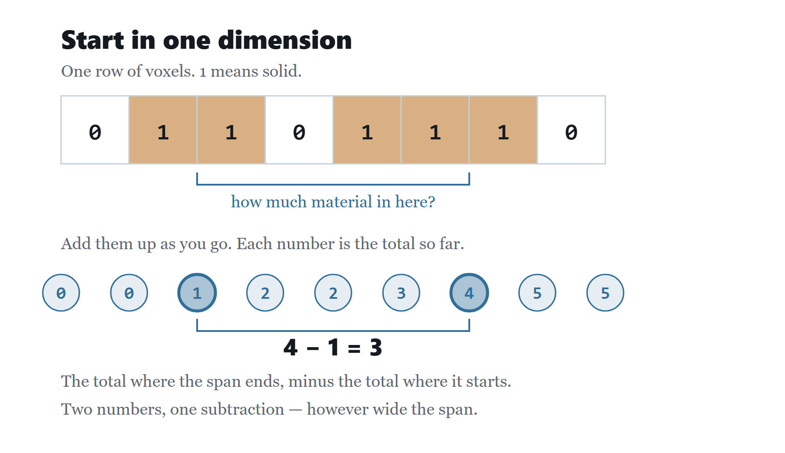
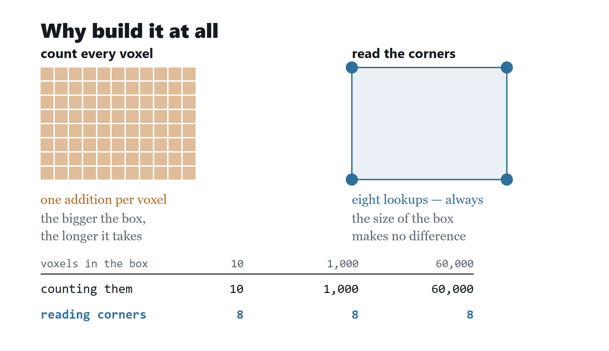
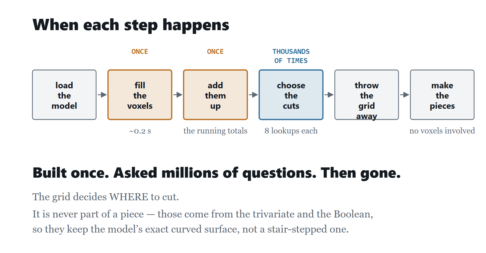
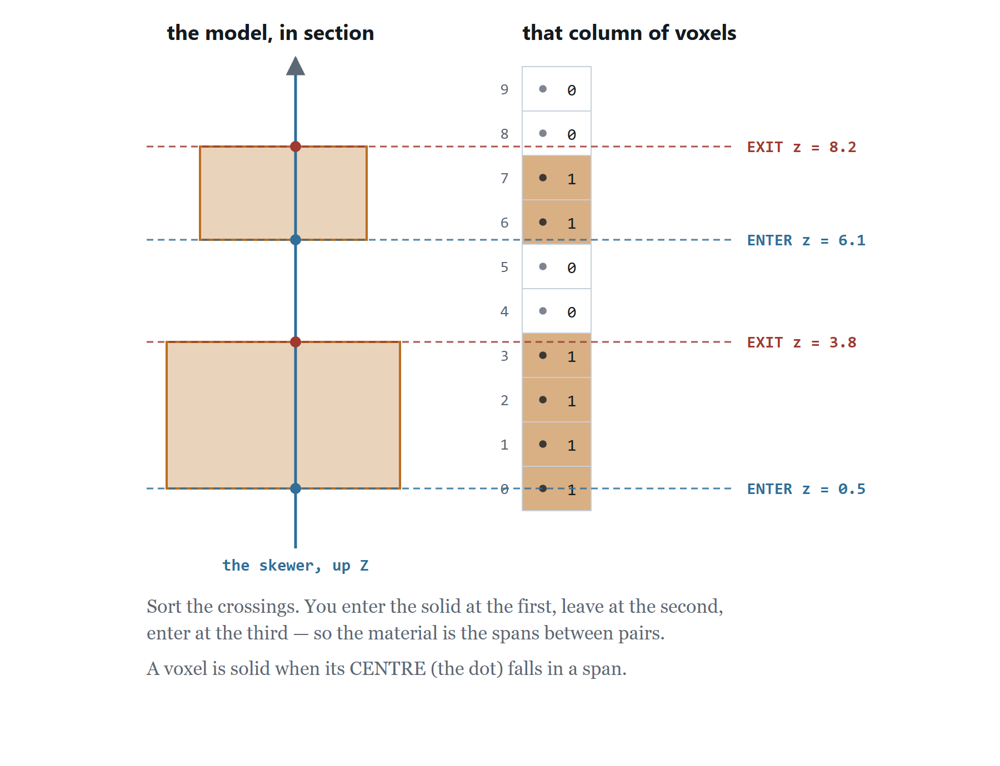
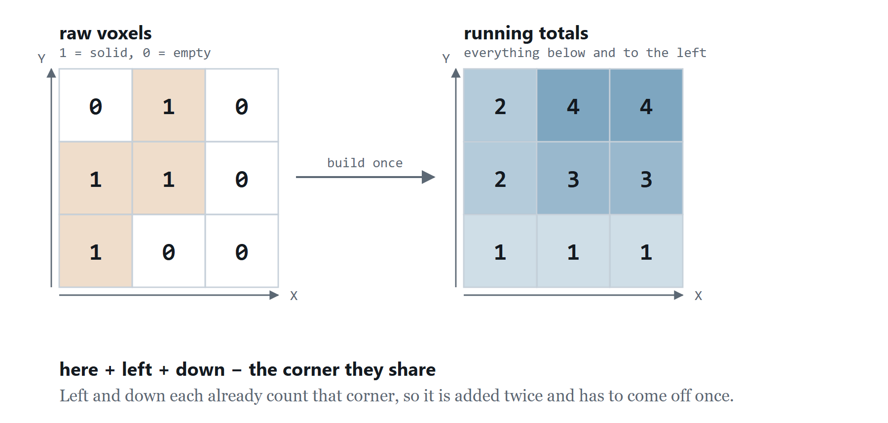
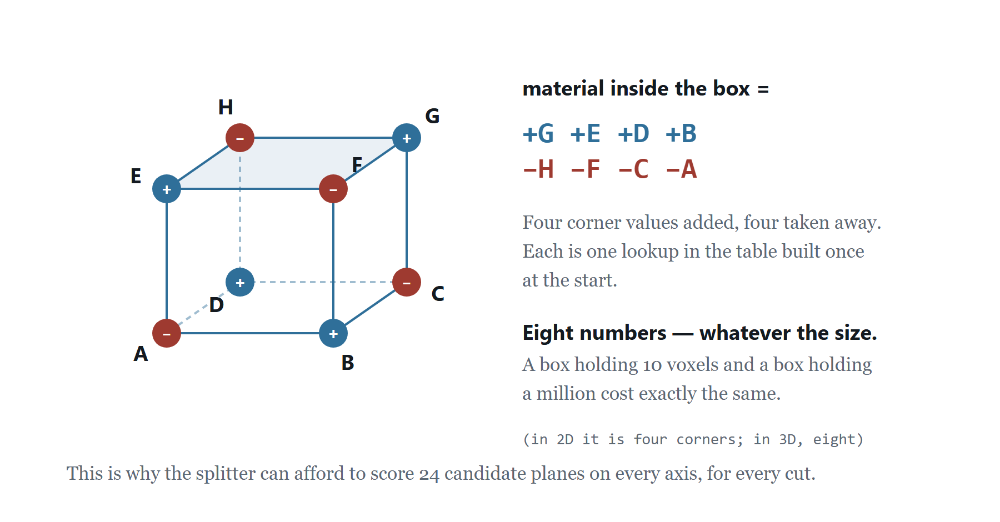

# How the division works — and which code does it

A walkthrough of the division, stage by stage, with the code responsible for
each. Written to be lifted into a presentation: each stage has one claim, the
file and function that implements it, and the few lines that actually decide
something.

Companion to `CAGE_AND_BSP.md`, which explains the same pipeline without the
code.

---

## Two representations, two jobs

The obvious objection first, because it is the one you will be asked:

> *"You say this is a V-rep method, but you voxelise the model. Isn't it a voxel
> method?"*

No, and the distinction is worth stating precisely because both representations
are genuinely present and they do different things.

| | **Voxels** (`MaterialField`) | **V-rep** (`TrivTVStruct`) |
|---|---|---|
| What it is | a scratch grid over the bounding box | the trivariate cage and its sub-volumes |
| What it decides | **where** the cut planes go | **what** each piece *is* |
| Lives for | the duration of the split | the whole pipeline |
| Appears in the output | **never** | every piece comes from one |
| If you change it | cut positions move by at most one voxel | the pieces themselves change |

**Voxels are the instrument, not the material.** They answer two questions and
nothing else — *how much model is inside this box?* and *is the model inside
this box one connected lump?* — and both answers are used only to choose a cut
plane. Once the planes are chosen the grid is discarded and never consulted
again.

**The pieces are never made of voxels.** A piece is a sub-trivariate extracted
by `IritTrivTVRegionFromTV`, intersected with the original mesh by an exact
Boolean. Nothing that reaches the output has been quantised to the grid. That is
why the pieces have the model's real curved surface and not a stair-stepped
approximation of it — compare any voxel-based interlocking-puzzle method, where
the blocky pieces *are* the voxels.

### The test that proves it

If the pieces were made of voxels, changing the resolution would change the
pieces. It does not. Same model, same requested count, resolution swept from 16
to 160:

| resolution | voxels | pieces returned | all connected |
|---|---|---|---|
| 16 | 2,496 | 6 | yes |
| 32 | 20,736 | 6 | yes |
| 64 | 169,344 | 6 | yes |
| 96 | 567,648 | 6 | yes |
| 160 | 2,615,680 | 6 | yes |

The cut planes shift slightly, so the pieces are not *identical* — but they are
always six valid pieces with the model's exact surface, and the geometry of each
comes from the trivariate and the Boolean, not from the grid. Resolution changes
**where** the knife falls, never **what** the knife cuts.

---

## The pipeline

```
  Mp              Mc               voxels            cells           sub-TVs          pieces
  mesh  ───────▶  cage    ───────▶ material ───────▶ BSP     ───────▶ region  ───────▶ ∩ Mp
  OBJ/STL         trivariate       field             cut planes       extract          Boolean
```

| # | Stage | File | Entry point |
|---|---|---|---|
| 1 | Build the cage | `Trivariate.cpp:232` | `Trivariate::boundingCage` |
| 2 | Measure the model | `MaterialField.cpp:9` | `MaterialField::build` |
| 3 | Choose the cuts | `PuzzleDivider.cpp:631` | `PuzzleDivider::buildBspTree` |
| 4 | Cells → solids | `PuzzleDivider.cpp:356` | `PuzzleDivider::divideCells` |
| 5 | Recover the shape | `CageBoolean.cpp` | `CageBoolean::intersectAll` |

Orchestrated by `AppController::divideRandom` (`AppController.cpp:560`) for the
app, and `cageCli` in `main.cpp` for `--cage`.

---

## Stage 1 — the cage

**Claim:** the model is wrapped in a trivariate B-spline box. It is not fitted
to the model and never needs to be; the detail comes back in stage 5.

`Trivariate::boundingCage` takes the mesh's bounds, pads any zero-thickness
axis, and calls one IRIT primitive:

```cpp
// Trivariate.cpp:157
void doCage(void *v)
{
    CageCtx *c = static_cast<CageCtx *>(v);
    c -> result = IritTrivNSPrimBox(c -> lo[0], c -> lo[1], c -> lo[2],
                                    c -> hi[0], c -> hi[1], c -> hi[2]);
}
```

What comes back is **trilinear** — orders 2/2/2, eight control points, all of
them corners, domain `[0,1]³`. Two consequences run through everything after:

- The parameter→world map is **diagonal and affine**, so a box in `(u,v,w)` is a
  box in `(x,y,z)`. Stage 3 relies on this.
- The cage has **no interior freedom**, so it cannot be shrink-wrapped as it
  stands, and every cut face comes out planar.

Everything IRIT-facing runs inside `IritGuard::run`, so a malformed file returns
an error instead of calling `exit()`.

---

## Stage 2 — measuring the model

**Claim:** before any cut is chosen, the model is voxelised once so that "how
much model is inside this box?" is answered in constant time.

### Voxelising, in detail

The grid is filled by **column parity**, in one pass over the triangles — not a
ray cast per voxel, which at 567,648 voxels would be hopeless.

**Step 1 — collect crossings.** Each triangle is projected onto the XY plane.
For every voxel column whose sample point falls inside that projection, the
triangle's height there is recorded as a crossing of that column:

```cpp
// MaterialField.cpp:72
const double jx = 0.5 + 1.0 / 512.0, jy = 0.5 + 1.0 / 337.0;
for (int i = i0; i <= i1; ++i) {
    const double px = (i + jx) * f.m_cell[0];
    for (int j = j0; j <= j1; ++j) {
        const double py = (j + jy) * f.m_cell[1];

        // Barycentric coordinates of the column centre.
        const double w0 = ((bx - px) * (cy - py) - (by - py) * (cx - px)) / det;
        const double w1 = ((cx - px) * (ay - py) - (cy - py) * (ax - px)) / det;
        const double w2 = 1.0 - w0 - w1;
        if (w0 < 0.0 || w1 < 0.0 || w2 < 0.0)
            continue;                      // sample point is outside this triangle

        const double z = w0 * (A[2] - org[2]) + w1 * (B[2] - org[2])
                       + w2 * (C[2] - org[2]);
        crossings[i * ny + j].append(float(z));
    }
}
```

The barycentric test is the point-in-triangle test; the same weights then
interpolate the height. `jx`/`jy` are the off-centre nudge explained below.

**Step 2 — fill between pairs.** Sort each column's crossings. Going up the
column you enter the solid at the first, leave at the second, enter at the
third, and so on — so the material is exactly the spans between consecutive
pairs:

```cpp
// MaterialField.cpp:104
const int pairs = zs.size() & ~1;
for (int p = 0; p + 1 < pairs; p += 2) {
    const int k0 = qMax(0,      int(std::ceil (zs[p]     / f.m_cell[2] - 0.5)));
    const int k1 = qMin(nz - 1, int(std::floor(zs[p + 1] / f.m_cell[2] - 0.5)));
    for (int k = k0; k <= k1; ++k)
        occ[(i * ny + j) * nz + k] = 1;
}
```

`zs.size() & ~1` drops an unpaired crossing. An odd count means the surface is
not closed along that column, and dropping the orphan keeps the error local
instead of flooding the rest of the column. **This is why watertight input
matters** — an open mesh produces odd columns.

A voxel counts as solid when its **centre** is inside. Not its corner, not any
overlap: the centre. That single rule is what makes the measure consistent.

**Step 3 — the running total.** A 3D prefix sum is built so that later queries
cost nothing:

```cpp
// MaterialField.cpp:119
f.m_sum[sumIndex(i, j, k)] =
      here
    + m_sum[i-1][j  ][k  ] + m_sum[i  ][j-1][k  ] + m_sum[i  ][j  ][k-1]
    - m_sum[i-1][j-1][k  ] - m_sum[i-1][j  ][k-1] - m_sum[i  ][j-1][k-1]
    + m_sum[i-1][j-1][k-1];
```

That is inclusion–exclusion in three dimensions: add the three faces, subtract
the three edges they double-count, add back the corner they then over-subtract.
`m_sum[i][j][k]` ends up holding the material volume of the whole block from the
origin to `(i,j,k)`.

**The query is the same identity, reversed.** `volumeIn`
(`MaterialField.cpp:275`) reads the material in any axis-aligned box from the
eight corners of that block — three added, three subtracted, and so on — in
constant time, whatever the box's size. That constant time is the entire reason
the splitter can afford to score 24 candidate planes per axis per cut.

**Connectivity** (`MaterialField.cpp:219`) is the one query that is not O(1):
`isConnected` flood-fills the occupied voxels inside a box through their six
face neighbours and reports whether they form a single lump. It runs only on a
candidate that has already passed the cost test, so a handful of times per cut.

The resolution is fixed on the longest axis (96) and the other two scale so the
voxels stay cubic — so the *count* depends on the bounding box's shape:

| Model | Grid | Voxels | Inside | Cube side |
|---|---|---|---|---|
| armadillo | 81 × 96 × 73 | 567,648 | 60,837 (10.7%) | 1.57 |
| sphere | 96 × 96 × 96 | 884,736 | 453,528 (51.3%) | 0.42 |

### The line that matters most in this file

```cpp
// MaterialField.cpp:72
const double jx = 0.5 + 1.0 / 512.0, jy = 0.5 + 1.0 / 337.0;
```

The sample point is nudged off the exact voxel centre. A centre landing on an
edge shared by two triangles is counted twice or not at all, and on a mesh whose
edges line up — a UV sphere's meridians, anything lathed or extruded — that
misfires along a whole seam, leaving an empty curtain of columns that splits the
model in two.

It was found because stage 3 started rejecting entire axes on a **sphere**,
where two hemispheres are obviously connected. Fixing it moved the sphere's
measured volume from **−1.40% to +0.07%**, because whole columns had been going
missing.

### Querying

A 3D prefix sum makes any axis-aligned box eight lookups:

```cpp
// MaterialField.cpp:275
double MaterialField::volumeIn(const double lo[3], const double hi[3]) const
```

and `isConnected` (`MaterialField.cpp:219`) flood-fills the voxels in a box to
answer "is the material in here one lump?".

### Figures for a talk

Two sets, generated from computed numbers rather than drawn by hand. The plain
set is for an audience seeing this for the first time; the detailed set is for
anyone who wants the mechanics.

**Plain — the idea, in three slides**

| | |
|---|---|
|  | One row of voxels, the running totals underneath. The material in any span is the total at its end minus the total at its start: `4 − 1 = 3`. Everything else is this, three times over. |
|  | Counting every voxel costs one addition per voxel; reading the corners of the running total costs eight lookups whatever the box's size. 60,000 vs 8. |
|  | Filled once, summed once, asked thousands of times while the cuts are chosen, then discarded. The pieces are made afterwards, from the trivariate — never from the grid. |

**Detailed — the mechanics**

| | |
|---|---|
|  | Step 1–2: crossings collected per column, filled between pairs. |
|  | Step 3: inclusion–exclusion building `m_sum`. |
|  | `volumeIn`: which eight corners are added and which subtracted. |

Both sets are regenerated by `docs/figures/voxel_simple.py` and
`docs/figures/voxel_figs.py`, then rendered to PNG by
`docs/figures/render_simple.py`. They assert their own arithmetic, so a
figure that disagrees with the algorithm fails to build rather than
shipping a wrong picture.

---

---

## Stage 3 — choosing the cuts

This is the heart of the method and the part that is ours rather than Elber's.
All of it is in `PuzzleDivider::buildBspTree`.

### 3a — which cell to split

**Always the cell holding the most material** — not the largest box, and not a
weighted random draw:

```cpp
// PuzzleDivider.cpp:697
int slot = -1;
double best = 0.0;
for (int i = 0; i < leaves.size(); ++i)
    if (weight[i] > best) { best = weight[i]; slot = i; }
```

where `weight[i]` is `material->volumeIn(cell.lo, cell.hi)`. Sampling instead of
taking the maximum is what once left a single piece holding **80% of the
armadillo** — with six pieces there are only five cuts, and if they land
elsewhere the big cell is never revisited.

### 3b — where to cut: a cost, not a threshold

The old rule accepted any plane leaving each side between 15% and 85% of the
material. That is a threshold nobody can defend — *why not 60/70?* — and inside
the window the position came from a random draw.

It is now a **cost that is minimised**:

```cpp
// PuzzleDivider.cpp:595
struct CutWeights {
    double balance = 1.0;   // live
    double thin    = 0.0;   // STUB - penalise cuts through a thin neck
    double discon  = 0.0;   // STUB - penalise cuts that sever a piece
};

struct CutCost {
    double imbalance     = 0.0;   // |left - right| / cellMaterial, in [0, 1]
    double thinness      = 0.0;   // STUB
    double disconnection = 0.0;   // STUB

    double total(const CutWeights &w) const
    {
        return w.balance * imbalance + w.thin * thinness + w.discon * disconnection;
    }
};
```

24 planes are sampled across the admissible span and scored:

```cpp
// PuzzleDivider.cpp:761
for (int c = 0; c < kCutCandidates; ++c) {
    const double cf = lo + (hi - lo) * (c + 0.5) / kCutCandidates;
    double cut[3] = { cell.hi[0], cell.hi[1], cell.hi[2] };
    cut[axis] = cell.lo[axis] + extent * cf;

    const double left  = material->volumeIn(cell.lo, cut);
    const double right = cellMat - left;
    if (left <= degenerate || right <= degenerate)
        continue;          // would make an empty or sliver cell

    CutCost cost;
    cost.imbalance = std::fabs(left - right) / cellMat;
    cands.append({ cf, cost.total(kCutWeights), cost.imbalance });
}
```

**The answer to "why not 60/70?" is that no ratio is chosen at all.** The
balance term's optimum is an even split, computed per cell from the material
actually present. The only remaining bound on where a plane may fall is
`minSide`, which is a *printability* limit on cell size.

### 3c — the connectivity constraint

The candidates are sorted by cost, then walked in order, taking the cheapest one
whose halves both stay in one piece:

```cpp
// PuzzleDivider.cpp:800
int picked = -1;
for (int c = 0; c < cands.size() && picked < 0; ++c) {
    if (pass != 0) { picked = c; break; }
    ...
    if (material->isConnected(cell.lo, cut) &&
        material->isConnected(rlo, cell.hi))
        picked = c;
}
```

Two passes (`PuzzleDivider.cpp:721`): the first demands connected halves, the
second drops that if no axis could manage it — because a severed piece can be
repaired after the Boolean, while a piece that was never created cannot.

### What these three choices guarantee

**The piece count is exact, by construction.** The root cell holds all the
material; a cut is accepted only if both halves keep some; therefore by
induction every leaf holds material, so no cell is ever empty and none is
dropped later.

| Asked | Cells | Pieces | Dropped |
|---|---|---|---|
| 6 | 6 | 6 | 0 |
| 7 | 7 | 7 | 0 |
| 10 | 10 | 10 | 0 |

(armadillo — the hardest case, since it fills only 10.7% of its own box)

And the size spread, same model, six pieces, same seed:

| Splitter | Smallest | Largest | Spread |
|---|---|---|---|
| by cage volume | 496 | 87,092 | 175× |
| by material, sampled leaf | 4,486 | 117,650 | 26× |
| by material, largest leaf, random share | 24,167 | 59,272 | 2.8× |
| **by material, largest leaf, minimum cost** | **30,073** | **57,314** | **1.91×** |

---

## Interlude — one cut, traced through both representations

Worth walking through in a talk, because it shows exactly where each
representation is used and where each stops.

| Step | Representation | What happens |
|---|---|---|
| pick the cell to split | **voxels** | `volumeIn` on every leaf; take the fullest |
| score 24 planes | **voxels** | `volumeIn` twice per plane → imbalance |
| reject severing cuts | **voxels** | `isConnected` on each half |
| **record the plane** | **V-rep** | the chosen `f` becomes a parameter coordinate on the cell box |
| extract the piece | **V-rep** | `IritTrivTVRegionFromTV`, three times |
| recover the surface | **mesh** | `IritBooleanAND` against the original model |

The grid is used four times to *decide*, then never again. The handover is a
single number — the cut fraction `f` — and after that the voxels have no further
say in what the piece looks like.

## Stage 4 — cells to solids

Each cell is an axis-aligned box **in the trivariate's parameter domain**. It
becomes a solid by three region extractions, one per axis:

```cpp
// PuzzleDivider.cpp:329
void doRegion(void *v)
{
    ...
    for (int a = 0; a < 3; ++a) {
        TrivTVStruct *next = IritTrivTVRegionFromTV(cur, c -> p0[a], c -> p1[a],
                                                    kDir[a]);
        ...
    }
}
```

**This is the V-rep step.** Each result is a genuine sub-trivariate — a solid
volumetric B-spline, not a surface patch. It is why no capping is needed and no
piece can come out as an open shell.

Each sub-trivariate is then tessellated to polygons, and from here on the piece
is a mesh.

---

## Stage 5 — recovering the model's shape

**Claim:** the boxy cell becomes a real piece by intersecting it with the
original mesh. Elber §5, Fig. 14d → 14e.

```cpp
// CageBoolean.cpp:34
c -> result = c -> unite ? IritBooleanOR(c -> a, c -> b)
                         : IritBooleanAND(c -> a, c -> b);
```

### The trap that cost the most

```cpp
// CageBoolean.cpp:150
IritPrsrObjectStruct *pieceObj = IritSolid::fromMesh(pieceFixed, IritSolid::Winding::Inward);
```

IRIT builds a polygon's plane from its vertex order, and the sign is the
**opposite** of the right-hand rule. Feeding it conventionally wound solids
inverts both containment tests and the intersection silently computes a
**union** — AND of a bounding box with an inscribed sphere returned the box,
reporting "8 clean, 0 failed" at 704% of the model volume.

**The check that catches it is volume:** the trimmed pieces must sum to the
model's own volume. Nothing else distinguishes a correct intersection from a
plausible-looking union.

### Three outcomes, told apart

| Outcome | Meaning | Action |
|---|---|---|
| `Ok` | real geometry | becomes the piece |
| `EmptyCell` | cell and model are disjoint | piece dropped |
| `Failed` | the boolean errored | keeps its boxy shape, reported |

Then each result is split into connected components
(`CageBoolean.cpp:365`), debris below 0.5% of an average piece is discarded, and
any remaining detached lump is welded back into the neighbour it touches
(`CageBoolean.cpp:419`). `multiPart` re-checks the finished pieces and must be 0.

---

## Where to change things

| To change | Edit |
|---|---|
| voxel resolution | `MaterialField::build`'s `maxRes` (default 96) |
| how many planes are scored | `kCutCandidates` in `buildBspTree` |
| add a cost term | `CutCost` / `CutWeights` — the stubs are already wired into `total()` |
| minimum piece size | `minSide` in `buildBspTree` (auto: `0.45·∛(V/N)`) |
| tessellation density | `kPieceFineNess` in `AppController.h` |
| make the cage tight | `Trivariate::boundingCage` — needs `IritTrivTVDegreeRaise` + `IritTrivTVRefineAtParams` first |

---

## Logs to show

**Per-cut decisions** — `BSP_LOG=1 ... --cage MODEL 6 7`:

```
SPLIT cell 0 · axis Y · 24 candidates
    -> chose f=0.679  imbalance 0.054  (rank 2 of 24)
SPLIT cell 2 · axis X · 24 candidates
    -> chose f=0.490  imbalance 0.029  (rank 1 of 24)
```

Rank 2 means the cheapest candidate would have severed a piece and the
next-cheapest was taken — the constraint doing its job, visibly.

**The volume check** — `--cage MODEL 6 7`:

```
VOL   model 2.3793e+05   cage pieces 2.218e+06 (932%)   trimmed 2.3793e+05 (100%)
BOOLEAN  6 piece(s) intersected cleanly, 0 dropped (empty cell), 0 failed
         every piece is a single connected solid
```

**Voxel grid and convergence** — `--field MODEL`.

---

## What to be careful claiming

- **The cuts are planar and axis-aligned.** The V-rep machinery is genuine, but
  a box cage means a box in `(u,v,w)` is a box in `(x,y,z)`. "We divide in
  V-rep" is true; "the cuts are freeform" is not, yet.
- **Do not call this a voxel method, and do not hide the voxels either.** The
  honest sentence is: *the division is computed in the trivariate's parameter
  domain and the pieces are sub-trivariates; a voxel field is used as a
  measuring instrument to choose the cut planes, and never appears in the
  output.* Both halves of that are true and the second is what makes the piece
  counts and the connectivity guarantee possible.
- **Watertight input is required.** IRIT's booleans produce garbage rather than
  an error on an open shell. The code checks and says so.
- **The divergence volume is not always the model's volume.** A mesh with
  interior geometry reads high — `beast.obj` measures 822,450 by divergence and
  527,590 by voxel fill, and the Boolean agrees with the voxels to 0.14%. Both
  figures are printed so a low percentage can be diagnosed rather than assumed.
